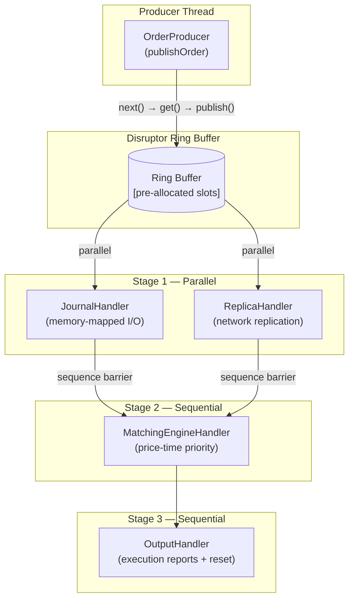
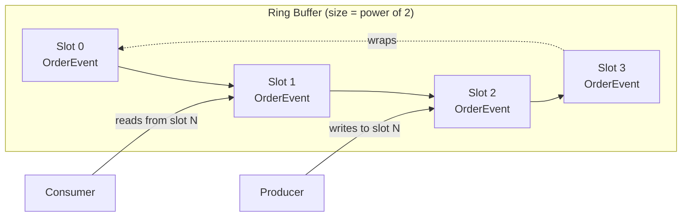
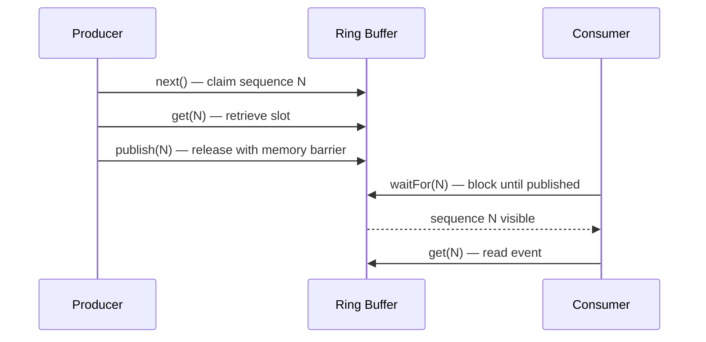
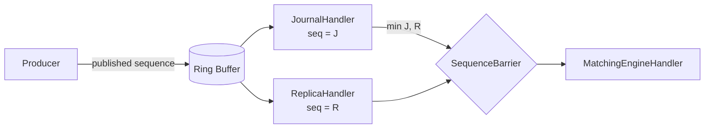
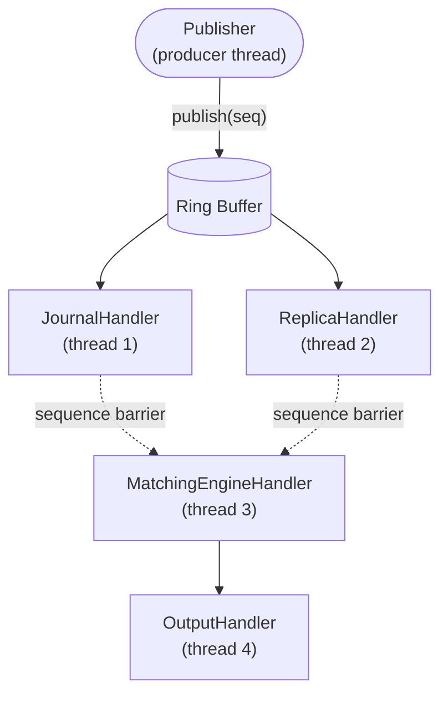
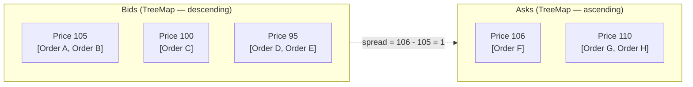
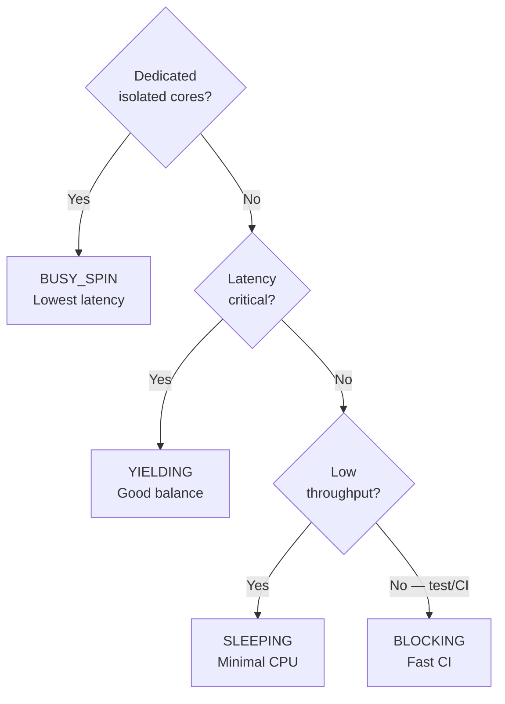

# SobySequencer Architecture

## Table of Contents

1. [Overview](#1-overview)
2. [System Architecture](#2-system-architecture)
3. [The Ring Buffer](#3-the-ring-buffer)
4. [Sequences and Sequence Barriers](#4-sequences-and-sequence-barriers)
5. [Handler Pipeline — Diamond Pattern](#5-handler-pipeline--diamond-pattern)
6. [Wait Strategies](#6-wait-strategies)
7. [Journal — Memory-Mapped I/O](#7-journal--memory-mapped-io)
8. [Matching Engine](#8-matching-engine)
9. [Latency Measurement](#9-latency-measurement)
10. [Thread Affinity and CPU Isolation](#10-thread-affinity-and-cpu-isolation)
11. [Configuration Reference](#11-configuration-reference)
12. [Production Considerations](#12-production-considerations)

---

## 1. Overview

SobySequencer is a low-latency event sequencer built on the [LMAX Disruptor](https://lmax-exchange.github.io/disruptor/) pattern. It models the core of a trading infrastructure component: a high-throughput order ingestion pipeline that durably journals events, replicates state, matches orders, and emits execution reports — all in strict sequence order with predictable, sub-microsecond latency.

### Design goals

| Goal | Mechanism |
|------|-----------|
| Sub-microsecond p99.9 latency | Lock-free ring buffer, busy-spin wait strategy, CPU affinity |
| Zero GC pressure on hot path | Pre-allocated ring buffer slots, no object allocation per event |
| Strict ordering | Single writer principle — only one thread writes to each slot |
| Durable persistence | Memory-mapped journal with ordered binary writes |
| Parallel stage processing | Diamond dependency pattern (journal ∥ replica → match → output) |

### Performance envelope

On modern server hardware with dedicated CPU cores:

| Metric | Value |
|--------|-------|
| Throughput | 1M–10M events/sec |
| p50 latency (journal) | ~1 µs |
| p99.9 latency (journal) | ~5 µs |
| GC pauses during benchmark | None (zero allocation path) |

---

## 2. System Architecture

### High-level component diagram



### Data flow

1. **Producer** calls `publishOrder()`, which claims a ring buffer slot, populates the pre-allocated `OrderEvent`, and publishes the sequence.
2. **JournalHandler** and **ReplicaHandler** receive the event simultaneously on separate threads — no coordination between them.
3. **MatchingEngineHandler** waits via a `SequenceBarrier` until both Stage 1 handlers have processed the event, then executes price-time priority matching.
4. **OutputHandler** logs the final event state, sends execution reports, and resets the slot for reuse.

### Key classes

| Class | Responsibility |
|-------|---------------|
| `Sequencer` | Owns the Disruptor, wires the handler pipeline |
| `OrderEvent` | Pre-allocated mutable slot object; lives in the ring buffer |
| `JournalHandler` | Writes events to a 64MB memory-mapped file |
| `MatchingEngineHandler` | Price-time priority order book matching |
| `OutputHandler` | Emits execution reports and resets the event slot |
| `LatencyRecorder` | HdrHistogram wrapper for nanosecond-precision percentiles |
| `AffinitySupport` | CPU thread affinity via OpenHFT |

---

## 3. The Ring Buffer

The ring buffer is the central data structure: a fixed-size, pre-allocated circular array of `OrderEvent` objects.



### Why power of 2?

Slot index calculation uses bitwise AND instead of modulo division:

```java
// Fast: single bitwise AND instruction
index = sequence & (bufferSize - 1);

// Slow: integer division (10× slower)
index = sequence % bufferSize;
```

The `SequencerConfig.Builder.build()` method automatically rounds any configured size up to the nearest power of 2.

### Pre-allocation and zero-GC

```java
// At construction: ring buffer allocates N OrderEvent objects once
for (int i = 0; i < bufferSize; i++) {
    entries[i] = factory.newInstance();  // OrderEventFactory.newInstance()
}

// On every publish: mutate the existing object, no allocation
event.setOrderId(orderId);
event.setPrice(price);
// ...
event.reset();  // Reset in OutputHandler for slot reuse
```

The slot objects are never discarded — they live for the lifetime of the process.

---

## 4. Sequences and Sequence Barriers

### Sequences

A **sequence** is a monotonically increasing `long` that identifies a slot in the ring buffer:

```
Slot index = sequence & (bufferSize - 1)
Sequence 0  → slot 0
Sequence 4  → slot 0 (again, for bufferSize=4)
Sequence 7  → slot 3
```

Each producer and consumer tracks its own sequence. The producer's sequence is the last *claimed* slot; each consumer's sequence is the last *processed* slot.



### Memory barriers

When the producer calls `publish(sequence)`, the Disruptor inserts a **store-store memory barrier** (via `VarHandle.setRelease` or `Unsafe.putOrderedLong`). This guarantees:

- All event field writes (orderId, price, quantity, …) complete *before* the sequence is visible to consumers.
- Consumers reading after observing the sequence see a fully consistent event.

### Sequence barriers and back-pressure

A **SequenceBarrier** lets a consumer depend on one or more upstream sequences:



`MatchingEngineHandler` can only advance to sequence N when `min(J, R) >= N`. The slowest Stage 1 handler limits Stage 2, which is how back-pressure propagates upstream to the producer.

---

## 5. Handler Pipeline — Diamond Pattern

### Topology



### Wiring in code

```java
disruptor
    .handleEventsWith(journalHandler, new ReplicaHandler())  // Stage 1: parallel
    .then(matchingEngineHandler)                             // Stage 2: after both complete
    .then(outputHandler);                                    // Stage 3: after matching
```

### Zero-copy semantics

All four handlers operate on the **same `OrderEvent` object in the ring buffer slot** — no serialization, no copying, no intermediate queues.

```
Slot N lifecycle:
  1. Producer populates fields        [thread: producer]
  2. JournalHandler reads + journals  [thread: handler-1]  ┐ concurrent
  3. ReplicaHandler reads + replicates[thread: handler-2]  ┘
  4. MatchingEngineHandler matches    [thread: handler-3]  (after 2+3)
  5. OutputHandler emits + resets     [thread: handler-4]  (after 4)
  → slot is now available for reuse
```

### Handler responsibilities

**JournalHandler** — durability
- Writes a 34-byte fixed-width entry to a 64MB memory-mapped file
- Records latency from event publish timestamp to journal write completion

**ReplicaHandler** — fault tolerance *(stub in this implementation)*
- In production: sends journal entries to a standby node via UDP multicast
- Runs concurrently with JournalHandler; neither blocks the other

**MatchingEngineHandler** — order matching
- Price-time priority matching using `TreeMap<Long, ArrayDeque<OrderEvent>>`
- Records the time taken by the matching computation itself

**OutputHandler** — reporting and slot reuse
- Logs the final event state (TRACE level)
- Calls `event.reset()` to clear all fields before the slot is recycled

---

## 6. Wait Strategies

The wait strategy controls how a handler thread waits for new events. This is the primary latency/CPU tradeoff knob.

### Strategy comparison

| Strategy | Latency | CPU while idle | Best for |
|----------|---------|----------------|----------|
| `BusySpinWaitStrategy` | ~100–200 ns | 100% (one core) | Dedicated isolated cores, HFT |
| `YieldingWaitStrategy` | ~500–2000 ns | High initially, drops | Shared cores, general production |
| `SleepingWaitStrategy` | ~5–20 µs | Minimal | Batch, power-constrained |
| `BlockingWaitStrategy` | ~20–100 µs | Zero | Unit tests, low throughput |

### How BusySpinWaitStrategy works

```java
while (cursor.get() < targetSequence) {
    // Tight spin — no syscalls, no context switches
    // Thread.onSpinWait() hint for CPU power management (Java 9+)
}
```

The thread never yields to the OS scheduler. On a dedicated, isolated core this gives sub-200ns detection latency. On a shared core it starves other threads.

### How BlockingWaitStrategy works

```java
synchronized (lock) {
    while (cursor.get() < targetSequence) {
        lock.wait();  // release lock, block in kernel
    }
}
// Producer calls lock.notifyAll() on publish
```

Requires a kernel context switch (~20 µs on Linux) but uses zero CPU while waiting. Used in all tests via `waitStrategy(BLOCKING)`.

---

## 7. Journal — Memory-Mapped I/O

### Why memory-mapped I/O?

| Operation | `FileOutputStream` | `MappedByteBuffer` |
|-----------|-------------------|-------------------|
| Write 64 KB | ~2 ms (syscall per write) | ~0.1 ms (page cache) |
| fsync | ~10 ms | Asynchronous |
| Copy overhead | User space → kernel buffer | Zero (direct page cache write) |

Memory-mapped writes bypass the `write()` syscall entirely. The OS page cache absorbs writes and flushes to disk asynchronously.

### Binary journal format

Each entry is 34 bytes:

```
Offset  Size  Field
──────  ────  ─────────────
0       8     sequenceNumber  (long)
8       8     orderId         (long)
16      8     price           (long, in ticks)
24      8     quantity        (long)
32      1     side            (0=BUY, 1=SELL)
33      1     type            (0=MARKET, 1=LIMIT)
```

64 MB / 34 bytes ≈ **1,904,823 entries per file**. The journal wraps (ring-style) when full.

### Write path

```java
public long journal(OrderEvent event) {
    int entryOffset = (int) (position % MAX_EVENTS) * ENTRY_SIZE;

    mappedBuffer.putLong(entryOffset,      event.getSequenceNumber());
    mappedBuffer.putLong(entryOffset + 8,  event.getOrderId());
    mappedBuffer.putLong(entryOffset + 16, event.getPrice());
    mappedBuffer.putLong(entryOffset + 24, event.getQuantity());
    mappedBuffer.put    (entryOffset + 32, event.getSide().getValue());
    mappedBuffer.put    (entryOffset + 33, event.getType().getValue());

    long completionTime = System.nanoTime();
    position++;

    latencyRecorder.record(completionTime - event.getTimestampNanos());
    return position;
}
```

### Durability guarantees

| What MappedByteBuffer provides | What it does NOT guarantee |
|--------------------------------|---------------------------|
| Data in OS page cache within milliseconds | Automatic fsync to disk |
| Survives application crash if page cache flushed | Durability across power failure |
| Fast sequential writes | Write ordering across multiple mmapped files |

For production crash safety, call `mappedBuffer.force()` periodically or on clean shutdown (as `JournalHandler.close()` does).

---

## 8. Matching Engine

The `MatchingEngineHandler` implements a **price-time priority** order book — the standard algorithm used in electronic exchanges.

### Order book structure



```java
// Bids: highest price has priority (use lastEntry() for best bid)
TreeMap<Long, ArrayDeque<OrderEvent>> bids = new TreeMap<>(Long::compareTo);

// Asks: lowest price has priority (use firstEntry() for best ask)
TreeMap<Long, ArrayDeque<OrderEvent>> asks = new TreeMap<>(Long::compareTo);
```

**Why `TreeMap`?** O(log p) insert/delete at each price level; O(1) best bid/ask via `lastEntry()`/`firstEntry()`. Price levels are sparse so a sorted map is appropriate.

**Why `ArrayDeque`?** O(1) append to tail (new order) and O(1) remove from head (matched order), with contiguous memory allocation — better cache performance than `LinkedList`.

### Matching rules

**Price priority** — better prices execute first:
- Buy side: higher price → earlier execution
- Sell side: lower price → earlier execution

**Time priority** — at equal price, earlier arrival executes first (FIFO queue per price level).

### Limit order matching

```
Incoming: LIMIT BUY @ 106 qty=100

Book state before:
  Best Ask: 106, queue=[Sell@106 qty=50, Sell@106 qty=70]

Step 1: buyPrice(106) >= bestAsk(106) → match
  Fill qty = min(100, 50) = 50
  Sell order fully consumed → remove from queue
  Buy order remaining = 50

Step 2: buyPrice(106) >= bestAsk(106) → match
  Fill qty = min(50, 70) = 50
  Sell order qty reduced to 20 → stays in queue
  Buy order fully filled → exit loop

Book state after:
  Best Ask: 106, queue=[Sell@106 qty=20]
```

### Market order matching

Market orders execute against the best available price regardless of level:

```
Incoming: MARKET BUY qty=200

Book state before:
  Ask 100: [Sell qty=80]
  Ask 102: [Sell qty=150]

Step 1: match at 100 → fill 80, ask level 100 exhausted
Step 2: match at 102 → fill 120, ask level 102 has 30 remaining
  Buy order fully filled

Book state after:
  Ask 102: [Sell qty=30]
```

### Complexity

| Operation | Complexity | Note |
|-----------|------------|------|
| Add order (new price level) | O(log p) | TreeMap insert; p = active price levels |
| Add order (existing level) | O(1) | ArrayDeque.offerLast |
| Match at best price | O(1) | firstEntry/lastEntry + peekFirst |
| Remove exhausted price level | O(log p) | TreeMap remove |
| Full sweep across p levels | O(p · log p) | Pathological market order |

In practice p is small (10–200 levels), so the TreeMap overhead is negligible.

---

## 9. Latency Measurement

### What is measured

Each handler stage measures its own processing time independently using `LatencyRecorder` (a `SynchronizedHistogram` wrapper):

| Recorder | What it measures |
|----------|-----------------|
| `journalLatencyRecorder` | Time from event publish timestamp → journal write completion (end-to-end to persistence) |
| `matchingLatencyRecorder` | Time for the matching computation itself (`processOrder` execution time) |
| `endToEndLatencyRecorder` | Available for custom end-to-end instrumentation |

### Why percentiles, not means

```
Two systems, same throughput, different latency profiles:

  System A:  all events at 10 µs           → mean=10 µs, p99.9=10 µs  ✓
  System B:  99.9% at 5 µs, 0.1% at 5 ms  → mean=10 µs, p99.9=5 ms   ✗

The mean is identical; System B's tail latency violates trading SLOs.
```

HdrHistogram tracks values from 1 ns to 1 s with 5 significant figures of precision, using ~3–5 MB of fixed memory regardless of sample count.

### Coordinated omission

SobySequencer avoids coordinated omission by timestamping at the **point of order submission** (`event.setTimestampNanos(System.nanoTime())`). The journal latency is computed as:

```
journalLatency = journalWriteCompleteTime - event.timestampNanos
```

This correctly captures any queueing delay the event experienced before the journal processed it — a 100 ms pipeline stall is reflected as a 100 ms+ latency for the event that was queued during the stall, not a 1 µs latency measured only from when processing resumed.

### Sample output

```
Journal Handler Latency:
  count:  1,000,000
  mean:   1,234 ns
  p50:      980 ns
  p95:    1,512 ns
  p99:    2,304 ns
  p99.9:  4,096 ns
  p99.99: 8,704 ns
  max:  125,312 ns

Matching Engine Handler Latency:
  count:  1,000,000
  mean:     312 ns
  p50:      256 ns
  p95:      480 ns
  p99:      768 ns
  p99.9:  1,536 ns
  p99.99: 3,072 ns
  max:   45,056 ns
```

The ~125 µs max in the journal represents an OS page fault (cold page) or scheduler interrupt — expected on a non-isolated system.

---

## 10. Thread Affinity and CPU Isolation

### The problem: cross-core cache thrashing

When a thread migrates between CPU cores, its working set (ring buffer slots, order book, histogram) must be re-fetched from shared LLC or main memory:

```
Without affinity:
  Core 0: Thread processes event N (data in L1 cache)
  Scheduler: moves thread to Core 1
  Core 1: Thread processes event N+1 → cache miss → ~100 ns refetch
  Core 0: Thread migrated again → another ~100 ns refetch

With affinity (thread pinned to Core 0):
  Core 0: Thread processes events N, N+1, N+2 ... → data stays in L1
  L1 hit latency: ~4 cycles (~1.5 ns at 3 GHz)
```

### AffinitySupport

```java
// Pins the calling thread to the specified core.
// The AffinityLock is held in a static list — releasing it would unpin the thread.
AffinitySupport.pinCurrentThreadToCore(config.getSequencerCpuCore());
```

The lock is held for the lifetime of the process. On Linux this calls `sched_setaffinity` via JNA; on macOS it sets Mach thread affinity hints (advisory, not strict).

### Linux kernel parameters for production

```bash
# GRUB_CMDLINE_LINUX in /etc/default/grub:
# isolcpus=2,3   — exclude cores 2,3 from the kernel scheduler
# nohz_full=2,3  — disable periodic timer interrupts (tickless mode)
# rcu_nocbs=2,3  — move RCU callbacks off these cores
GRUB_CMDLINE_LINUX="isolcpus=2,3 nohz_full=2,3 rcu_nocbs=2,3"
```

After rebooting:
```bash
# Verify your Java process is running on the correct cores
ps -eLo psr,pid,comm | grep java

# Check interrupt counts per core — isolated cores should show very low counts
cat /proc/interrupts | grep -E "CPU[23]"
```

### NUMA topology

On multi-socket servers, memory accesses to a "remote" NUMA node cost ~200 ns vs ~100 ns local:

```bash
numactl --hardware                          # show NUMA topology
numactl --cpunodebind=0 --membind=0 java … # pin process to NUMA node 0
```

---

## 11. Configuration Reference

Configuration is built via `SequencerConfig.Builder` and can be overridden with system properties:

```bash
./gradlew run -DringBufferSize=8192 -DwaitStrategy=YIELDING -DenableAffinity=false
```

| Property | Default | Description |
|----------|---------|-------------|
| `ringBufferSize` | `4096` | Ring buffer capacity; rounded up to next power of 2 |
| `waitStrategy` | `BUSY_SPIN` | `BUSY_SPIN`, `YIELDING`, `SLEEPING`, `BLOCKING` |
| `enableAffinity` | `true` | Pin producer thread to `cpuCore` |
| `cpuCore` | `0` | CPU core for producer thread affinity |
| `warmupPublishCount` | `100000` | Events published in warm-up phase (not measured) |
| `benchmarkPublishCount` | `1000000` | Events published in benchmark phase |

### Selecting a wait strategy by environment



---

## 12. Production Considerations

### Durability

The journal uses asynchronous OS page cache writeback. For guaranteed durability:

**Option A — Batch fsync** (adds latency to batch tail)
```java
if (position % 1000 == 0) {
    mappedBuffer.force();  // ~5–10 ms, blocks until written to disk
}
```

**Option B — Dedicated flush thread** (up to 1 second data loss on crash)
```java
ScheduledExecutorService flusher = Executors.newSingleThreadScheduledExecutor();
flusher.scheduleAtFixedRate(() -> mappedBuffer.force(), 1, 1, TimeUnit.SECONDS);
```

**Option C — Commit markers** (enables point-in-time recovery)
```
Entry layout with commit marker:
  [length: 4 bytes][data: 34 bytes][COMMIT_MARKER: 4 bytes]
On recovery: scan for valid commit markers, replay to last complete entry.
```

### Journal rotation

At ~1.9M entries per 64MB file, a high-throughput system fills the journal in seconds. Implement rotation:

1. On wrap (`position % MAX_EVENTS == 0`): archive current file to `journal-{timestamp}.dat`
2. Create a new mapped file for continued writes
3. Compaction daemon: delete archives older than retention period

### State machine replication

The `ReplicaHandler` stub models a hot-standby pattern:

```
Active Sequencer                         Standby Sequencer
┌───────────────────┐                    ┌───────────────────┐
│ JournalHandler    │                    │                   │
│ ReplicaHandler ───┼──── UDP multicast ─┼──> Journal replay │
│ MatchingEngine    │                    │    State sync      │
└───────────────────┘                    └───────────────────┘
         │◄──────────────── Heartbeat ──────────────────────►│
```

Failover: standby detects missed heartbeats, promotes itself, redirects VIP in < 100 ms.

### FIX protocol integration

Incoming `NewOrderSingle (35=D)` messages parsed to `OrderEvent` fields:

| FIX Tag | Field | `OrderEvent` field |
|---------|-------|--------------------|
| 55 | Symbol | `symbol` |
| 54 | Side (1=Buy, 2=Sell) | `side` |
| 38 | OrderQty | `quantity` |
| 44 | Price | `price` (integer ticks) |
| 40 | OrdType (1=Market, 2=Limit) | `type` |

`OutputHandler` would emit `ExecutionReport (35=8)` messages back to clients via QuickFIX/J.

### Risk pre-checks

Insert a `RiskHandler` before `MatchingEngineHandler` in Stage 1:

```java
disruptor
    .handleEventsWith(journalHandler, replicaHandler, riskHandler)
    .then(matchingEngineHandler)
    .then(outputHandler);
```

Checks to implement: position limits, order rate limits (per client/symbol), price band circuit breakers, margin requirements.

### Monitoring

Key metrics to expose via JMX or Prometheus:

| Metric | Alert threshold |
|--------|----------------|
| `journal_latency_p99_ns` | > 10 ms |
| `matching_latency_p99_ns` | > 5 ms |
| `ring_buffer_fill_pct` | > 80% |
| `order_rejection_rate` | > 1% |
| `journal_position_mod_max` | Approaching 1 (imminent wrap) |
