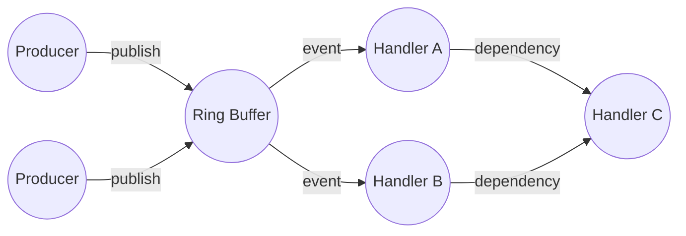
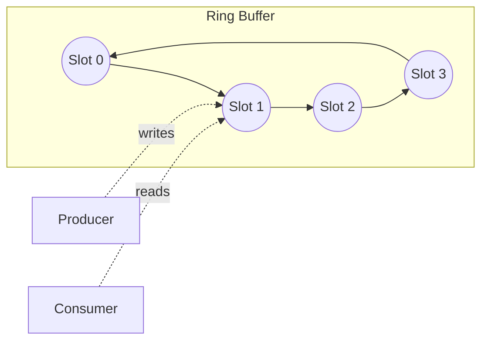
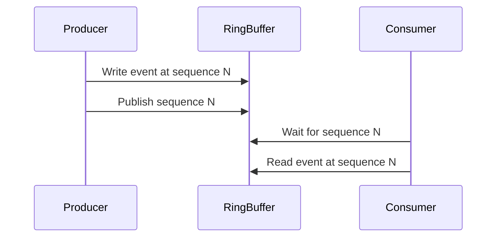
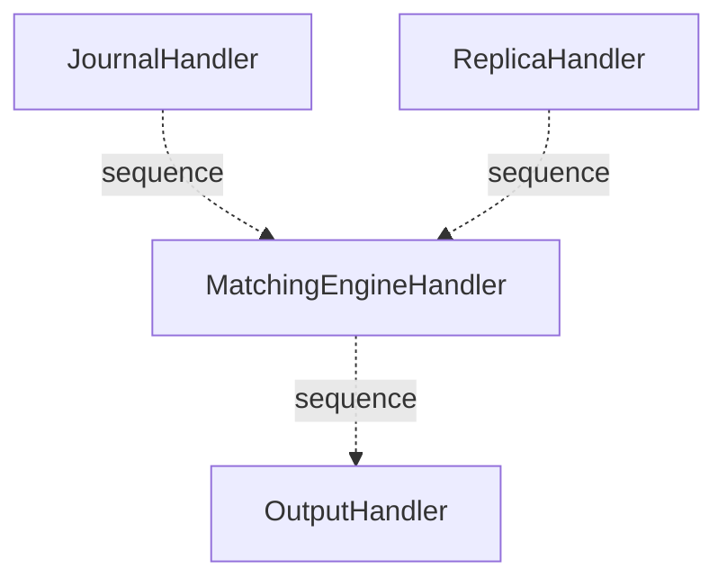
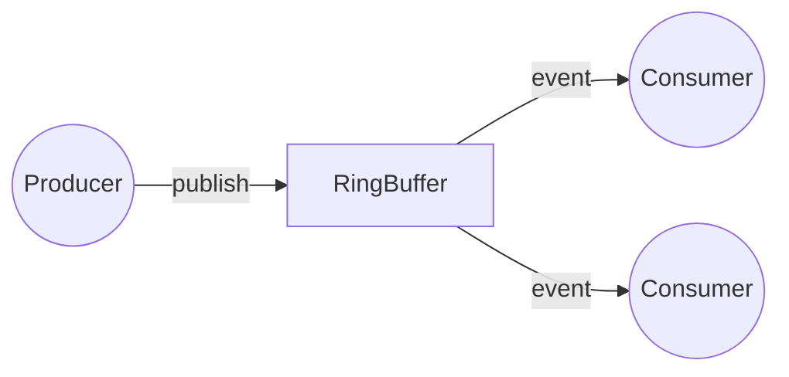
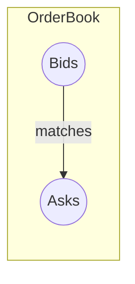
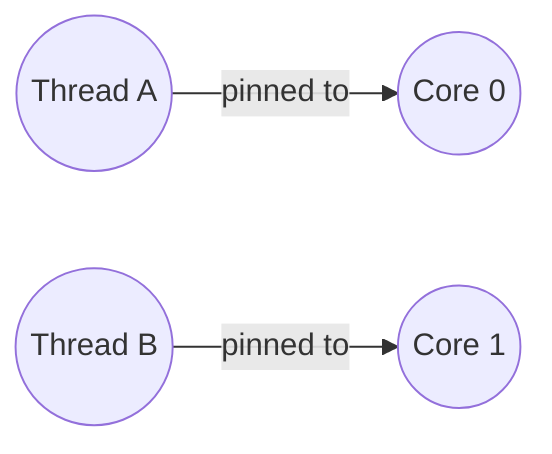

# SobySequencer Architecture

## Glossary of Disruptor and Concurrency Terminology

This section provides in-depth explanations of the core concepts and terminology used throughout this document and in the SobySequencer codebase. Understanding these terms is essential for grasping the architecture and performance characteristics of the system.

### Disruptor
The Disruptor is a high-performance inter-thread messaging library and concurrency pattern developed by LMAX for ultra-low-latency systems. It replaces traditional queues with a lock-free, single-writer ring buffer and a set of coordinated consumers (handlers). The Disruptor pattern is designed to:
- Eliminate locks and minimize contention between threads
- Avoid garbage collection (GC) pauses by pre-allocating all data structures
- Enable extremely high throughput and low, predictable latency

**How it works:**
Producers claim slots in a ring buffer, write data, and publish a sequence. Consumers (handlers) process events in the buffer, each tracking their own progress via sequence numbers. The Disruptor coordinates dependencies between consumers using sequence barriers.

**Mermaid diagram:**


### Ring Buffer
A ring buffer (circular buffer) is a fixed-size, pre-allocated array that wraps around when the end is reached. In the Disruptor, the ring buffer holds event objects (such as orders) that are passed from producers to consumers. The buffer size is always a power of two, enabling efficient index calculation using bitwise operations (bitmasking). Each slot is reused, eliminating the need for frequent memory allocation and reducing garbage collection pressure.

**Key properties:**
- Fixed size, power-of-two length for fast modulo
- Pre-allocated objects (no runtime allocation)
- Circular addressing (wraps around)
- Used for high-speed producer-consumer communication

**Mermaid diagram:**


### Sequence
A sequence is a monotonically increasing number that represents the position of an event in the ring buffer. Each producer and consumer maintains its own sequence value. Sequences are used to coordinate access to the buffer, track progress, and implement back-pressure. In the Disruptor, the sequence is the primary means of synchronization, replacing locks.

**Details:**
- The producer increments its sequence as it publishes new events.
- Each consumer tracks the last sequence it has processed.
- Sequences are used to determine buffer availability and to coordinate dependencies between handlers.

**Mermaid diagram:**


### Sequence Barrier
A sequence barrier is a coordination mechanism that allows a consumer to wait until a specific sequence (or set of sequences) has been published by producers or processed by other consumers. Sequence barriers are used to enforce dependencies between handlers (e.g., ensuring that the MatchingEngineHandler does not process an event until the JournalHandler and ReplicaHandler have finished with it).

**How it works:**
- Each handler can depend on one or more other handlers.
- The sequence barrier tracks the minimum sequence of all dependencies.
- The handler waits until all dependencies have processed up to a given sequence before proceeding.

**Mermaid diagram:**


### Wait Strategy
A wait strategy defines how a thread waits for a condition to be met (such as a new event being available in the ring buffer). The Disruptor provides several wait strategies, each with different trade-offs between latency and CPU usage:

- **BusySpinWaitStrategy**: The thread spins in a tight loop, checking the condition repeatedly. This provides the lowest latency but uses 100% CPU on the waiting thread. Best for dedicated CPU cores.
- **YieldingWaitStrategy**: The thread yields control to the OS scheduler when waiting, reducing CPU usage but increasing latency slightly. Good for shared CPU environments.
- **SleepingWaitStrategy**: The thread sleeps for short intervals (e.g., microseconds), minimizing CPU usage but increasing latency further. Suitable for low-throughput or power-constrained environments.
- **BlockingWaitStrategy**: The thread blocks on a lock or condition variable, using no CPU while waiting but incurring the highest latency due to context switches. Used for tests or low-throughput production.

**Choosing a wait strategy:**
- Busy spin for lowest latency, dedicated hardware
- Yielding for moderate latency, shared hardware
- Sleeping/blocking for low throughput or power saving

### Memory Barrier
A memory barrier (or fence) is a CPU instruction that enforces ordering constraints on memory operations. In concurrent programming, memory barriers ensure that writes performed by one thread are visible to other threads in the correct order. The Disruptor uses memory barriers (e.g., via `Unsafe.putOrderedLong` or `VarHandle.setRelease`) to guarantee that event data is fully written before the sequence number is published, preventing consumers from seeing stale or partially written data.

**Types of memory barriers:**
- Store-store barrier: Ensures all previous writes are visible before a subsequent write.
- Load-load barrier: Ensures all previous reads are completed before subsequent reads.
- Full fence: Ensures all previous reads and writes are completed before any subsequent reads or writes.

**In the Disruptor:**
When a producer publishes a sequence, a store-store barrier ensures that all event data is visible to consumers before the sequence number is updated.

### Single Writer Principle (SWP)
The Single Writer Principle states that only one thread should write to a given memory location at any time. By adhering to this principle, the Disruptor eliminates the need for locks on the write path, reducing contention and improving throughput. In SobySequencer, the producer thread is the only writer to each slot in the ring buffer, while consumers only read from their assigned slots.

**Benefits:**
- No need for locks or atomic operations on the write path
- Eliminates false sharing and cache line contention
- Simplifies reasoning about concurrency

### Producer and Consumer
- **Producer**: A thread or component that creates and publishes events into the ring buffer. In SobySequencer, the OrderProducer is responsible for publishing new orders. There can be one or more producers, but each slot in the buffer is written by only one producer at a time.
- **Consumer (Handler)**: A thread or component that processes events from the ring buffer. Handlers in SobySequencer include the JournalHandler, ReplicaHandler, MatchingEngineHandler, and OutputHandler. Each consumer tracks its own sequence and may depend on other consumers.

**Mermaid diagram:**


### Back-pressure
Back-pressure is a mechanism that prevents producers from overwhelming consumers. In the Disruptor, back-pressure is implemented by blocking the producer when the ring buffer is full (i.e., when all slots are occupied by unprocessed events). The producer must wait until consumers have advanced their sequences and freed up slots.

**How it works:**
- The producer checks the minimum sequence of all consumers.
- If the buffer is full (producer's next sequence would overwrite an unprocessed event), the producer waits.
- This ensures that slow consumers do not cause data loss or buffer corruption.

### False Sharing
False sharing occurs when multiple threads modify variables that reside on the same CPU cache line, causing unnecessary cache invalidations and performance degradation. The Disruptor mitigates false sharing by padding sequence variables so that each resides on its own cache line, ensuring that updates by one thread do not interfere with others.

**Example:**
If two threads update variables that are adjacent in memory and share a cache line, each update invalidates the other's cache, causing performance to degrade dramatically. Padding variables to cache line boundaries prevents this.

### Cache Line
A cache line is the smallest unit of memory that can be transferred between main memory and the CPU cache. On modern CPUs, a cache line is typically 64 bytes. Proper alignment and padding of frequently updated variables (such as sequences) to cache line boundaries is critical for performance in concurrent systems.

**Why it matters:**
- If two variables share a cache line and are updated by different threads, false sharing can occur.
- Aligning variables to cache line boundaries ensures each thread's data is isolated in the cache.

### MappedByteBuffer
MappedByteBuffer is a Java NIO class that allows a file to be mapped directly into memory. This enables high-speed, zero-copy I/O operations, as reads and writes to the buffer are translated directly to file offsets by the operating system. In SobySequencer, the journal uses MappedByteBuffer to persist events to disk with minimal overhead.

**Benefits:**
- No need to copy data between user space and kernel space
- OS handles paging and caching
- Enables very fast sequential I/O

### Order Book
An order book is a data structure that tracks buy and sell orders for a financial instrument, organized by price and time. The matching engine uses the order book to match incoming orders according to price-time priority, ensuring fair and efficient execution.

**Mermaid diagram:**


### Latency Percentiles (p50, p99, p99.9, etc.)
Latency percentiles are statistical measures that describe the distribution of response times in a system. For example, p99.9 latency is the value below which 99.9% of all observed latencies fall. Tracking high percentiles is critical for understanding and optimizing the tail behavior of low-latency systems.

**Why percentiles matter:**
- Mean/average latency can hide outliers and tail latency
- High percentiles (p99, p99.9) reveal worst-case performance

### HdrHistogram
HdrHistogram is a high dynamic range histogram library designed for recording and analyzing latency data with high precision and a wide value range. It is used in SobySequencer to measure and report latency percentiles.

**Features:**
- Tracks values from microseconds to hours
- Configurable precision
- Efficient memory usage

### Thread Affinity
Thread affinity is the practice of binding a thread to a specific CPU core, reducing context switches and cache misses. This can significantly improve the predictability and consistency of latency in real-time systems.

**Benefits:**
- Reduces cache misses and context switches
- Improves latency predictability

**Mermaid diagram:**


---

## 1. Overview

SobySequencer is a low-latency event sequencer built on the LMAX Disruptor pattern. It implements a message-passing architecture for processing trading orders with minimal latency and maximum throughput.

In a real trading system, this sequencer would sit between market data feeds and matching engines, ensuring orders are processed in strict sequence order while handling multiple downstream consumers (risk checks, logging, routing, etc.).

Key characteristics:
- **Low latency**: p99.9 latencies in the low microsecond range
- **High throughput**: 1M+ orders per second on modern hardware
- **Zero GC pressure**: Pre-allocated ring buffer entries
- **Single writer principle**: No locks on the hot path

## 2. The Single Writer Principle

The Disruptor is built on the Single Writer Principle (SWP): only one thread may write to a particular memory location at any time. This eliminates the need for locks and memory barriers on the write path.

### Why SWP Matters

Without SWP (traditional synchronized queue):
```
Producer Thread:     [claim slot] -> [lock acquire] -> [write data] -> [unlock] -> [publish]
Consumer Thread:     [lock acquire] -> [read data] -> [process] -> [unlock]
```

With SWP (Disruptor):
```
Producer Thread:     [claim slot] -> [write data] -> [release barrier] -> [publish sequence]
Consumer Thread:     [wait for sequence] -> [read data] -> [process]
```

The producer never blocks waiting for consumers, only for the ring buffer to have available slots. Consumers can process at their own pace.

### Throughput Impact

- Traditional queue: ~200K ops/sec with lock contention
- Disruptor SWP: 10M+ ops/sec single producer
- Disruptor with multiple producers: ~1M ops/sec (still needs some coordination)

## 3. The Ring Buffer

The ring buffer is the core data structure of the Disruptor. It's a pre-allocated, circular array of event objects.

### Why Power of 2?

Ring buffer size must be a power of 2 because of the index calculation:

```java
// Efficient modulo using bitwise AND
index = sequence & (bufferSize - 1)  // For power of 2
// Instead of: index = sequence % bufferSize
```

The bitmask `& (bufferSize - 1)` is a single CPU instruction, while modulo `%` requires division which is much slower.

### Pre-allocation and GC

The ring buffer is pre-allocated at construction time:
- No allocations during normal operation
- All event objects are reused via `reset()`
- Zero GC pressure under steady-state load

### Producer Back-pressure

When the ring buffer is full (all slots occupied by unprocessed events):
- Producer blocks waiting for a slot to become available
- Wait strategy determines how the producer waits (busy-spin, yielding, sleeping, or blocking)
- This is the only point where producers might need to wait

## 4. Memory Barriers and the Java Memory Model

On modern CPUs with out-of-order execution and store buffers, writes to memory may not be immediately visible to other threads.


                    [JournalHandler]
                   /                \
[Publisher] ----->                  -----> [MatchingEngineHandler] -----> [OutputHandler]
                   \                /
                    [ReplicaHandler]
```

### How It Works

1. **Stage 1 (Parallel)**: JournalHandler and ReplicaHandler both see the same event slot simultaneously
   - JournalHandler writes to disk
   - ReplicaHandler would send to backup (stub for now)
   - Both must complete before next stage

2. **Stage 2 (Sequential)**: MatchingEngineHandler waits for both parallel handlers to complete
   - Uses `SequenceBarrier` to track progress
   - Processes order book matching

3. **Stage 3 (Sequential)**: OutputHandler runs after matching
   - Logs results
   - (Would publish execution reports in production)

### Diamond Pattern Benefits

- Parallel execution for independent operations (journal + replica)
-Guarantees ordering within each branch
- No data copying - all handlers see the same event slot

### Sequence Barriers

Each consumer tracks its progress via a `Sequence` object. The Disruptor uses these to:
- Track which events each handler has processed
- Ensure consumers don't leapfrog each other
- Implement back-pressure when needed

## 6. Wait Strategies

The wait strategy determines how consumers/producer wait when there's no work to do or no slots available.

### BusySpinWaitStrategy

```
 while (sequence < cursor) {
     // Spin - keep checking
 }
```

**Pros:**
- Lowest latency (no context switch overhead)
- Best for CPU-bound workloads

**Cons:**
- 100% CPU usage on waiting thread
- Not suitable for shared CPU environments

**Use when:** Dedicated cores, lowest latency required

### YieldingWaitStrategy

```
 while (sequence < cursor) {
     Thread.yield();
 }
```

**Pros:**
- Lower CPU usage than busy spin
- Still relatively low latency

**Cons:**
- Some scheduler overhead
- Latency more variable

**Use when:** Shared CPU environments, acceptable latency

### SleepingWaitStrategy

```
 while (sequence < cursor) {
     LockSupport.parkNanos(1000);  // Sleep 1 microsecond
 }
```

**Pros:**
- Very low CPU usage
- Good for low-throughput scenarios

**Cons:**
- Higher latency (sleep granularity)
- Not suitable for high-frequency trading

**Use when:** Low throughput, power-constrained environments

### BlockingWaitStrategy

```
 while (sequence < cursor) {
     lock.lock();
     try {
         condition.await();
     } finally {
         lock.unlock();
     }
 }
```

**Pros:**
- Zero CPU when waiting
- Fast wake-up time

**Cons:**
- Context switch overhead
- Latency spikes when waking up

**Use when:** Tests, low-throughput production

## 7. The Journal (Memory-Mapped I/O)

The journal uses `MappedByteBuffer` to write events to disk.

### How MappedByteBuffer Works

```java
FileChannel channel = new RandomAccessFile("journal.dat", "rw").getChannel();
MappedByteBuffer buffer = channel.map(FileChannel.MapMode.READ_WRITE, 0, FILE_SIZE);
```

The OS maps a file into virtual memory. Reads/writes to `buffer` are:
1. Translated to file offsets by OS
2. Cached in OS page cache
3. Written to disk asynchronously or on fsync

### Why Faster Than FileOutputStream

| Operation | FileOutputStream | MappedByteBuffer |
|-----------|------------------|------------------|
| Write 64KB | ~2ms (syscalls) | ~0.1ms (cache) |
| Read 64KB | ~1ms | ~0.05ms |
| fsync | ~10ms | Asynchronous |

** Reasons:**
- Fewer syscalls (buffered vs each write syscall)
- OS page cache provides batching
- Zero-copy when reading back
- Better for sequential I/O patterns

### Durability Guarantees

**What MappedByteBuffer provides:**
- Data is written to OS page cache
- OS will eventually write to disk
- Performance benefits

**What it does NOT guarantee:**
- No fsync! Data might be lost on crash
- No ordering guarantees across multiple buffers
- Data in memory, not disk, until OS flushes

**For production, you would:**
- Use `MappedByteBuffer.force()` after batches
- Or wrap in `FileChannel` with explicit sync
- Or use a database for ACID guarantees

## 8. The Matching Engine

The matching engine maintains an order book with price-time priority.

### Order Book Structure

```
Bids (Buying)                    Asks (Selling)
Price    Quantity                Price    Quantity
105      100                     106      50
104      200                     107      100
103      150                     108      75
```

### Price-Time Priority

1. **Price Priority**: Better price comes first
   - Best bid (highest) matches first
   - Best ask (lowest) matches first

2. **Time Priority**: FIFO within same price level
   - Earlier orders matched first
   - Implemented with `ArrayDeque` per price level

### Data Structure Choices

**Why TreeMap for price levels:**
- Automatically sorts by price
- O(log n) insert/delete
- `firstEntry()` / `lastEntry()` for best prices

**Why ArrayDeque for same-price orders:**
- O(1) add to end (FIFO)
- O(1) remove from front (FIFO)
- Better cache locality than LinkedList

### Algorithm Complexity

| Operation | Complexity |
|-----------|------------|
| Add order | O(log n) - TreeMap insert |
| Cancel order | O(log n) - TreeMap delete |
| Match orders | O(m) where m = orders matched |
| Find best bid/ask | O(1) - first/last entry |

### Production Enhancements

For production systems:
- Replace TreeMap with array-indexed by tick price
- Pre-allocate all objects to avoid GC
- Use lock-free algorithms for state updates
- Implement partial fills and order cancellation

## 9. Latency Measurement

### Why Percentiles Matter

Averages lie. Consider these two systems:

**System A:** All requests 10ms
- Mean: 10ms, p99: 10ms

**System B:** 99% at 5ms, 1% at 500ms
- Mean: 10ms, p99: 500ms

Same mean, very different user experience!

### HdrHistogram

HdrHistogram (High Dynamic Range Histogram) is designed for latency measurements:

**Key features:**
- Tracks values from microseconds to hours
- Configurable precision (signficant figures)
- Thread-safe (SynchronizedHistogram)
- Calculates any percentile in O(1)

**Why not use standard deviation?**
- Latency distributions are highly skewed
- Outliers dominate the mean
- Percentiles reveal the tail behavior

### Coordinated Omission

**Problem:** Standard latency recording averages out the slow paths.

When a system takes 100ms to process a request:
- If you measure 1000 ops/sec average
- And each op takes 1ms
- You only measure 10 ops during the 100ms freeze
- Latency appears to be 1ms, but actual is 100ms

**Solution:** SobySequencer's approach
- We record latency from event timestamp to completion
- Events are published continuously (not affected by backlog)
- We get true end-to-end latency

### Latency Buckets

```
p50   - Median latency (50% of requests)
p95   - 95% of requests faster than this
p99   - 99% of requests faster than this
p99.9 - 99.9% of requests faster than this
p99.99- 99.99% of requests faster than this
max   - Worst case observed
```

**Rule of thumb:**
- p99.9 is the minimum for SLOs
- p99.99 reveals problems p99 misses
- p99.999 is for critical systems

## 10. Thread Affinity

Thread affinity pins a thread to a specific CPU core.

### What Problem Does It Solve?

**CPU cache thrashing:**
```
Core 0: Thread A (writes to cache line X)
Core 1: Thread B (reads cache line X)
Core 0: Writes to cache line X
Core 1: Cache miss, fetch from memory
Core 0: Writes to cache line X
Core 1: Cache miss again...
```

Every cross-core accessinvalidates the cache line, causing memory fetches.

### How Affinity Helps

```
Core 0: Thread A (all accesses to cache line X)
Core 1: Thread B (all accesses to cache line Y)
```

No cache invalidation between threads.

### CPU Isolation with `isolcpus`

In Linux, the `isolcpus` kernel parameter:
```
isolcpus=2,3,4,5
```

Tells the kernel:
- Don't schedule regular processes on these CPUs
- Reserve them for specific tasks
- Prevent scheduler interference

Result: Lower latency, less jitter.

### NUMA Considerations

On multi-socket servers:
- Each socket has its own memory
- Accessing remote socket memory is 2x slower
- Affinity should consider NUMA topology

### AffinityLock

LMAX's AffinityLock provides:
- Automatic CPU selection
- thread ID naming for debugging
- Graceful fallback if affinity fails

## 11. What a Production System Would Add

SobySequencer is a minimal viable implementation. A production system would add:

### State Machine Replication
- Hot standby with state sync
- Failover on crash
- Raft or Paxos for consensus

### FIX Protocol Handler
- Parse incoming FIX messages
- Generate execution reports
- Heartbeat and session management

### Risk Pre-checks
- Position limits before matching
- Margin calculations
- Circuit breakers

### Market Data Integration
- Order book visualization
- Market depth tracking
- Trade surveillance

### Persistence and Recovery
- Journal replay on startup
- State snapshotting
- Point-in-time recovery

### Monitoring
- JMX metrics
- Prometheus exports
- Alerting on anomalies

### Performance Enhancements
- Array-indexed order book (O(1) lookups)
- Vectorized matching algorithms
- CPU cache optimization

## Code Diagram

```
┌─────────────────────────────────────────────────────────────┐
│                     SobySequencer                           │
├─────────────────────────────────────────────────────────────┤
│                                                             │
│  ┌──────────────┐     ┌──────────────┐                      │
│  │   Producer   │────>│  Sequencer   │─┐                    │
│  └──────────────┘     └──────────────┘ │                    │
│                                        │                    │
│  ┌─────────────────────────────────────┴───────────────────┐│
│  │                  Disruptor Ring Buffer                  ││
│  │  [Slot 0] [Slot 1] [Slot 2] ... [Slot N-1]             ││
│  │   Order    Order    Order           Order              ││
│  │   Event    Event    Event           Event              ││
│  └─────────────────────────────────────────────────────────┘│
│                                                             │
│  ┌──────────┐  ┌──────────┐  ┌──────────┐  ┌──────────┐    │
│  │ Journal  │  │ Replica  │  │ Matching │  │  Output  │    │
│  │  Handler │  │  Handler │  │  Engine  │  │  Handler │    │
│  └────┬─────┘  └────┬─────┘  └────┬─────┘  └────┬─────┘    │
│       │             │             │             │           │
│  ┌────┴────┐  ┌────┴────┐  ┌────┴────┐  ┌────┴────┐       │
│  │  File   │  │ Network │  │ Order   │  │  Logs,   │       │
│  │  System │  │  Layer  │  │ Book    │  │ Reporting │       │
│  └─────────┘  └─────────┘  └─────────┘  └─────────┘       │
│                                                             │
└─────────────────────────────────────────────────────────────┘
