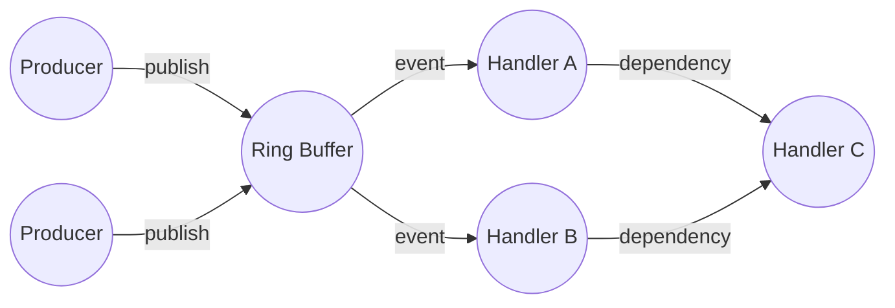
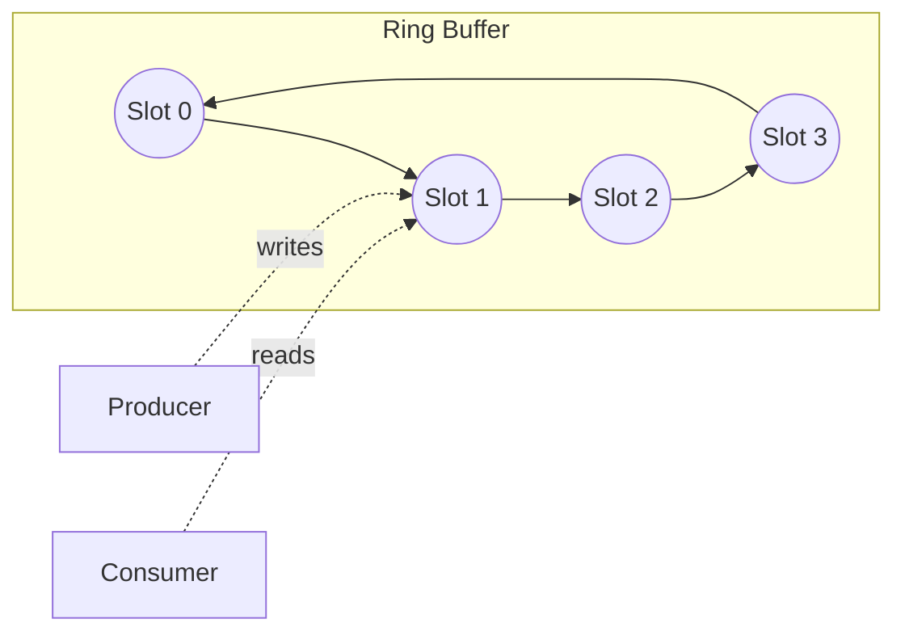
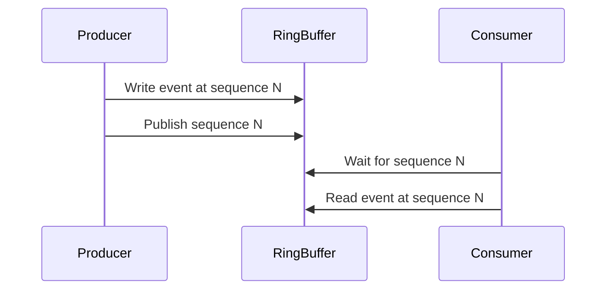
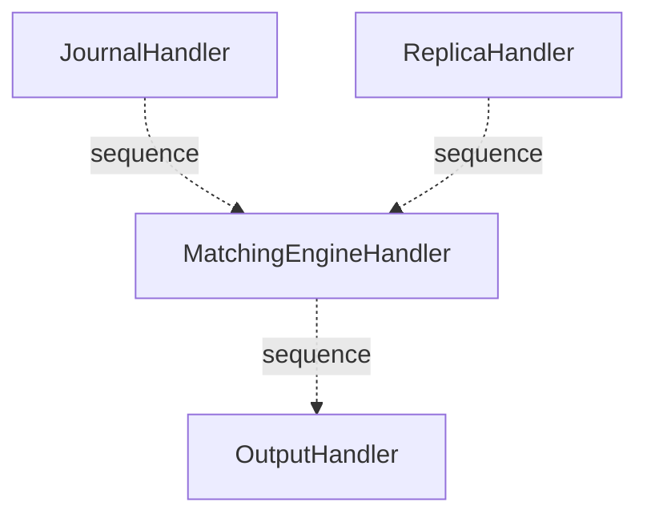
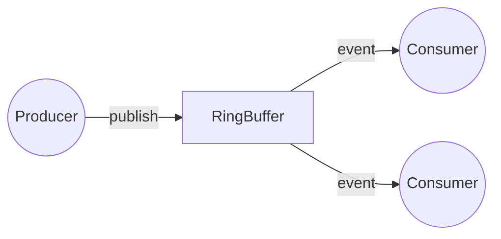
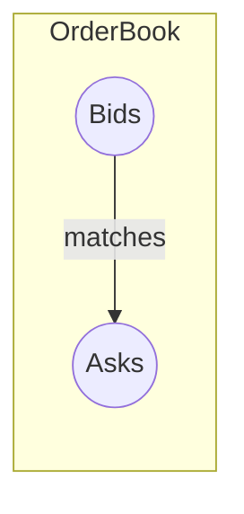
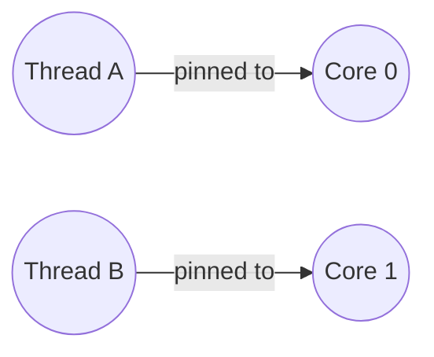
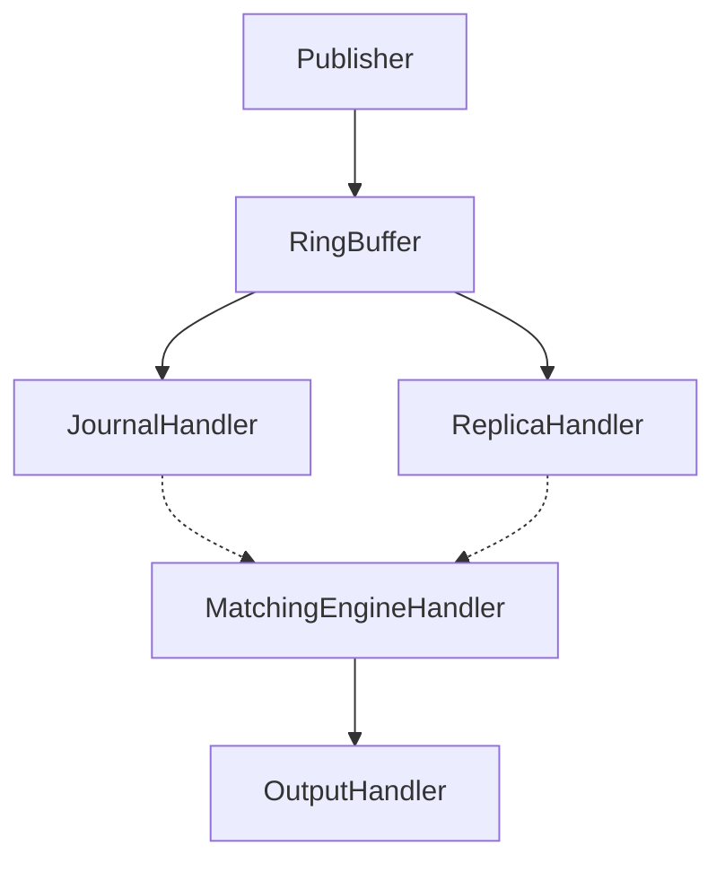

# SobySequencer Architecture

## Glossary of Disruptor and Concurrency Terminology

This section provides in-depth explanations of the core concepts and terminology used throughout this document and in the SobySequencer codebase. Understanding these terms is essential for grasping the architecture and performance characteristics of the system.

### Disruptor
The Disruptor is a high-performance inter-thread messaging library and concurrency pattern developed by LMAX for ultra-low-latency systems. It replaces traditional queues with a lock-free, single-writer ring buffer and a set of coordinated consumers (handlers). The Disruptor pattern is designed to:
- Eliminate locks and minimize contention between threads
- Avoid garbage collection (GC) pauses by pre-allocating all data structures
- Enable extremely high throughput and low, predictable latency

**How it works:**
Producers claim slots in a ring buffer, write data, and publish a sequence. Consumers (handlers) process events in the buffer, each tracking their own progress via sequence numbers. The Disruptor coordinates dependencies between consumers using sequence barriers.

**Mermaid diagram:**


### Ring Buffer
A ring buffer (circular buffer) is a fixed-size, pre-allocated array that wraps around when the end is reached. In the Disruptor, the ring buffer holds event objects (such as orders) that are passed from producers to consumers. The buffer size is always a power of two, enabling efficient index calculation using bitwise operations (bitmasking). Each slot is reused, eliminating the need for frequent memory allocation and reducing garbage collection pressure.

**Key properties:**
- Fixed size, power-of-two length for fast modulo
- Pre-allocated objects (no runtime allocation)
- Circular addressing (wraps around)
- Used for high-speed producer-consumer communication

**Mermaid diagram:**


### Sequence
A sequence is a monotonically increasing number that represents the position of an event in the ring buffer. Each producer and consumer maintains its own sequence value. Sequences are used to coordinate access to the buffer, track progress, and implement back-pressure. In the Disruptor, the sequence is the primary means of synchronization, replacing locks.

**Details:**
- The producer increments its sequence as it publishes new events.
- Each consumer tracks the last sequence it has processed.
- Sequences are used to determine buffer availability and to coordinate dependencies between handlers.

**Mermaid diagram:**


### Sequence Barrier
A sequence barrier is a coordination mechanism that allows a consumer to wait until a specific sequence (or set of sequences) has been published by producers or processed by other consumers. Sequence barriers are used to enforce dependencies between handlers (e.g., ensuring that the MatchingEngineHandler does not process an event until the JournalHandler and ReplicaHandler have finished with it).

**How it works:**
- Each handler can depend on one or more other handlers.
- The sequence barrier tracks the minimum sequence of all dependencies.
- The handler waits until all dependencies have processed up to a given sequence before proceeding.

**Mermaid diagram:**


### Wait Strategy
A wait strategy defines how a thread waits for a condition to be met (such as a new event being available in the ring buffer). The Disruptor provides several wait strategies, each with different trade-offs between latency and CPU usage:

- **BusySpinWaitStrategy**: The thread spins in a tight loop, checking the condition repeatedly. This provides the lowest latency but uses 100% CPU on the waiting thread. Best for dedicated CPU cores.
- **YieldingWaitStrategy**: The thread yields control to the OS scheduler when waiting, reducing CPU usage but increasing latency slightly. Good for shared CPU environments.
- **SleepingWaitStrategy**: The thread sleeps for short intervals (e.g., microseconds), minimizing CPU usage but increasing latency further. Suitable for low-throughput or power-constrained environments.
- **BlockingWaitStrategy**: The thread blocks on a lock or condition variable, using no CPU while waiting but incurring the highest latency due to context switches. Used for tests or low-throughput production.

**Choosing a wait strategy:**
- Busy spin for lowest latency, dedicated hardware
- Yielding for moderate latency, shared hardware
- Sleeping/blocking for low throughput or power saving

### Memory Barrier
A memory barrier (or fence) is a CPU instruction that enforces ordering constraints on memory operations. In concurrent programming, memory barriers ensure that writes performed by one thread are visible to other threads in the correct order. The Disruptor uses memory barriers (e.g., via `Unsafe.putOrderedLong` or `VarHandle.setRelease`) to guarantee that event data is fully written before the sequence number is published, preventing consumers from seeing stale or partially written data.

**Types of memory barriers:**
- Store-store barrier: Ensures all previous writes are visible before a subsequent write.
- Load-load barrier: Ensures all previous reads are completed before subsequent reads.
- Full fence: Ensures all previous reads and writes are completed before any subsequent reads or writes.

**In the Disruptor:**
When a producer publishes a sequence, a store-store barrier ensures that all event data is visible to consumers before the sequence number is updated.

### Single Writer Principle (SWP)
The Single Writer Principle states that only one thread should write to a given memory location at any time. By adhering to this principle, the Disruptor eliminates the need for locks on the write path, reducing contention and improving throughput. In SobySequencer, the producer thread is the only writer to each slot in the ring buffer, while consumers only read from their assigned slots.

**Benefits:**
- No need for locks or atomic operations on the write path
- Eliminates false sharing and cache line contention
- Simplifies reasoning about concurrency

### Producer and Consumer
- **Producer**: A thread or component that creates and publishes events into the ring buffer. In SobySequencer, the OrderProducer is responsible for publishing new orders. There can be one or more producers, but each slot in the buffer is written by only one producer at a time.
- **Consumer (Handler)**: A thread or component that processes events from the ring buffer. Handlers in SobySequencer include the JournalHandler, ReplicaHandler, MatchingEngineHandler, and OutputHandler. Each consumer tracks its own sequence and may depend on other consumers.

**Mermaid diagram:**


### Back-pressure
Back-pressure is a mechanism that prevents producers from overwhelming consumers. In the Disruptor, back-pressure is implemented by blocking the producer when the ring buffer is full (i.e., when all slots are occupied by unprocessed events). The producer must wait until consumers have advanced their sequences and freed up slots.

**How it works:**
- The producer checks the minimum sequence of all consumers.
- If the buffer is full (producer's next sequence would overwrite an unprocessed event), the producer waits.
- This ensures that slow consumers do not cause data loss or buffer corruption.

### False Sharing
False sharing occurs when multiple threads modify variables that reside on the same CPU cache line, causing unnecessary cache invalidations and performance degradation. The Disruptor mitigates false sharing by padding sequence variables so that each resides on its own cache line, ensuring that updates by one thread do not interfere with others.

**Example:**
If two threads update variables that are adjacent in memory and share a cache line, each update invalidates the other's cache, causing performance to degrade dramatically. Padding variables to cache line boundaries prevents this.

### Cache Line
A cache line is the smallest unit of memory that can be transferred between main memory and the CPU cache. On modern CPUs, a cache line is typically 64 bytes. Proper alignment and padding of frequently updated variables (such as sequences) to cache line boundaries is critical for performance in concurrent systems.

**Why it matters:**
- If two variables share a cache line and are updated by different threads, false sharing can occur.
- Aligning variables to cache line boundaries ensures each thread's data is isolated in the cache.

### MappedByteBuffer
MappedByteBuffer is a Java NIO class that allows a file to be mapped directly into memory. This enables high-speed, zero-copy I/O operations, as reads and writes to the buffer are translated directly to file offsets by the operating system. In SobySequencer, the journal uses MappedByteBuffer to persist events to disk with minimal overhead.

**Benefits:**
- No need to copy data between user space and kernel space
- OS handles paging and caching
- Enables very fast sequential I/O

### Order Book
An order book is a data structure that tracks buy and sell orders for a financial instrument, organized by price and time. The matching engine uses the order book to match incoming orders according to price-time priority, ensuring fair and efficient execution.

**Mermaid diagram:**


### Latency Percentiles (p50, p99, p99.9, etc.)
Latency percentiles are statistical measures that describe the distribution of response times in a system. For example, p99.9 latency is the value below which 99.9% of all observed latencies fall. Tracking high percentiles is critical for understanding and optimizing the tail behavior of low-latency systems.

**Why percentiles matter:**
- Mean/average latency can hide outliers and tail latency
- High percentiles (p99, p99.9) reveal worst-case performance

### HdrHistogram
HdrHistogram is a high dynamic range histogram library designed for recording and analyzing latency data with high precision and a wide value range. It is used in SobySequencer to measure and report latency percentiles.

**Features:**
- Tracks values from microseconds to hours
- Configurable precision
- Efficient memory usage

### Thread Affinity
Thread affinity is the practice of binding a thread to a specific CPU core, reducing context switches and cache misses. This can significantly improve the predictability and consistency of latency in real-time systems.

**Benefits:**
- Reduces cache misses and context switches
- Improves latency predictability

**Mermaid diagram:**


---

## 1. Overview

SobySequencer is a low-latency event sequencer built on the LMAX Disruptor pattern. It implements a message-passing architecture for processing trading orders with minimal latency and maximum throughput.

In a real trading system, this sequencer would sit between market data feeds and matching engines, ensuring orders are processed in strict sequence order while handling multiple downstream consumers (risk checks, logging, routing, etc.).

Key characteristics:
- **Low latency**: p99.9 latencies in the low microsecond range
- **High throughput**: 1M+ orders per second on modern hardware
- **Zero GC pressure**: Pre-allocated ring buffer entries
- **Single writer principle**: No locks on the hot path

## 2. The Single Writer Principle

The Disruptor is built on the Single Writer Principle (SWP): only one thread may write to a particular memory location at any time. This eliminates the need for locks and memory barriers on the write path.

### Why SWP Matters

Without SWP (traditional synchronized queue):
```
Producer Thread:     [claim slot] -> [lock acquire] -> [write data] -> [unlock] -> [publish]
Consumer Thread:     [lock acquire] -> [read data] -> [process] -> [unlock]
```

With SWP (Disruptor):
```
Producer Thread:     [claim slot] -> [write data] -> [release barrier] -> [publish sequence]
Consumer Thread:     [wait for sequence] -> [read data] -> [process]
```

The producer never blocks waiting for consumers, only for the ring buffer to have available slots. Consumers can process at their own pace.

### Throughput Impact

- Traditional queue: ~200K ops/sec with lock contention
- Disruptor SWP: 10M+ ops/sec single producer
- Disruptor with multiple producers: ~1M ops/sec (still needs some coordination)

## 3. The Ring Buffer

The ring buffer is the core data structure of the Disruptor. It's a pre-allocated, circular array of event objects.

### Why Power of 2?

Ring buffer size must be a power of 2 because of the index calculation:

```java
// Efficient modulo using bitwise AND
index = sequence & (bufferSize - 1)  // For power of 2
// Instead of: index = sequence % bufferSize
```

The bitmask `& (bufferSize - 1)` is a single CPU instruction, while modulo `%` requires division which is much slower.

### Pre-allocation and GC

The ring buffer is pre-allocated at construction time:
- No allocations during normal operation
- All event objects are reused via `reset()`
- Zero GC pressure under steady-state load

### Producer Back-pressure

When the ring buffer is full (all slots occupied by unprocessed events):
- Producer blocks waiting for a slot to become available
- Wait strategy determines how the producer waits (busy-spin, yielding, sleeping, or blocking)
- This is the only point where producers might need to wait

## 4. Memory Barriers and the Java Memory Model

On modern CPUs with out-of-order execution and store buffers, writes to memory may not be immediately visible to other threads. The Java Memory Model (JMM) defines how threads interact through memory and what guarantees are provided about visibility of writes.

### Memory Visibility Guarantees

The Disruptor's implementation relies on Java's memory model guarantees. When a producer writes to an event slot and then publishes the sequence, the Disruptor uses `Unsafe.putOrderedLong` (acquire-release semantics) which establishes a happens-before relationship. This ensures:

1. All writes to the event data (orderId, symbol, price, etc.) complete before the sequence is published
2. Consumers will see a consistent view of the event data when they observe the published sequence
3. No reordering of the data write before the sequence publish

### Implementation in Sequencer

The `publishOrder` method demonstrates this pattern:

```java
public void publishOrder(long orderId, String symbol, Side side, OrderType type,
                         long price, long quantity) {
  RingBuffer<OrderEvent> ringBuffer = disruptor.getRingBuffer();
  long sequence = ringBuffer.next();
  try {
    var event = ringBuffer.get(sequence);
    // Step 1: Write all event data (no barriers here - SWP guarantees single writer)
    event.setOrderId(orderId);
    event.setSymbol(symbol);
    event.setSide(side);
    event.setType(type);
    event.setPrice(price);
    event.setQuantity(quantity);
    event.setTimestampNanos(System.nanoTime());
    event.setState(OrderEvent.EventState.PUBLISHED);
  } finally {
    // Step 2: Publish sequence with release semantics (memory barrier)
    ringBuffer.publish(sequence);
  }
}
```

The Disruptor handles the memory barrier on the `publish(sequence)` call, ensuring all prior writes to the event are visible to consumers. Consumers reading after waiting for the sequence are guaranteed to see a fully initialized event object.

---

## 5. The Diamond Dependency Pattern

The Disruptor supports complex event processing topologies beyond simple linear chains. SobySequencer implements a diamond pattern for parallel processing:



### Architecture

1. **Stage 1 (Parallel)**: JournalHandler and ReplicaHandler both receive events at the same sequence
   - JournalHandler writes event data to memory-mapped file for durability
   - ReplicaHandler would replicate to backup nodes (stub implementation)
   - Both run concurrently on separate threads with no lock contention

2. **Stage 2 (Sequential)**: MatchingEngineHandler depends on both Stage 1 handlers
   - Uses SequenceBarrier to track min sequence of JournalHandler and ReplicaHandler
   - Waits until both Stage 1 handlers complete before processing
   - Processes order book matching logic

3. **Stage 3 (Sequential)**: OutputHandler runs after matching
   - Logs final event state
   - Would send execution reports via FIX protocol in production

### How Sequence Barriers Work

The diamond pattern is implemented via Disruptor's `handleEventsWith()` and `then()`:

```java
disruptor
    .handleEventsWith(journalHandler, new ReplicaHandler())  // Parallel stage
    .then(matchingEngineHandler)                             // Wait for both
    .then(outputHandler);                                    // Final stage
```

When `MatchingEngineHandler` needs to consume an event at sequence N, it:
1. Queries its SequenceBarrier for the minimum of (JournalHandler.sequence, ReplicaHandler.sequence)
2. Blocks via wait strategy until that minimum >= N
3. Processes the event once both dependencies complete

### Zero-Copy Semantics

A critical optimization in the diamond pattern: **all handlers see the same event slot object**. There is no data copying between handlers. The OrderEvent object is:
1. Populated by producer in ring buffer slot
2. Read by JournalHandler and ReplicaHandler (parallel)
3. Read by MatchingEngineHandler (after both complete)
4. Read by OutputHandler (after matching)
5. Reset by OutputHandler for reuse

This eliminates the need for:
- Serialization/deserialization between stages
- Message passing between handlers
- Additional allocations for intermediate results

### Throughput Implications

The diamond pattern enables:
- **I/O parallelism**: Disk writes (journal) run independent of network sends (replica)
- **Backpressure propagation**: Slow consumer in Stage 2 blocks both Stage 1 handlers
- **Latency measurement**: Each stage can timestamp its completion independently

---

## 6. Wait Strategies in Detail

The wait strategy determines how producer and consumer threads wait for state changes. This is a critical tuning parameter affecting latency, throughput, and CPU utilization.

### BusySpinWaitStrategy

```java
public void waitFor(long sequence) {
  while (cursor.get() < sequence) {
    // Tight spin loop - no OS involvement
  }
}
```

**Memory barrier**: Full acquire on exit spin

**CPU impact**: 100% of one CPU core while waiting

**Typical latency**: < 200ns to detect availability

**Best use cases**:
- Dedicated CPU cores with `isolcpus` kernel parameter
- Sub-microsecond latency requirements
- High event rates where waiting is infrequent

**Implementation notes**: The Disruptor uses `Unsafe` with acquire-release semantics. The spin loop is compiled to a tight assembly loop without syscalls.

---

### YieldingWaitStrategy

```java
public void waitFor(long sequence) {
  int counter = 0;
  while (cursor.get() < sequence) {
    if (++counter > TIMEOUT) {
      Thread.sleep(1);  // Back off after 100 iterations
    } else {
      Thread.yield();   // Suggest scheduler to run other threads
    }
  }
}
```

**CPU impact**: High initially, drops over time

**Typical latency**: 500-2000ns to detect availability

**Best use cases**:
- Shared CPU cores (non-realtime workloads on same core)
- Mixed priorities where other threads need occasional CPU time
- Development/testing environments

**Trade-offs**: The yield hint is not guaranteed - the OS may ignore it. Most schedulers honor yield by moving the thread to the back of the run queue for its priority class.

---

### SleepingWaitStrategy

```java
public void waitFor(long sequence) {
  int counter = 0;
  while (cursor.get() < sequence) {
    if (counter > 100) {
      LockSupport.parkNanos(1000);  // Park for 1 microsecond
      counter = 0;
    } else {
      counter++;
    }
  }
}
```

**CPU impact**: Minimal - threads park quickly

**Typical latency**: 5-20 microseconds (park overhead + resume)

**Best use cases**:
- Power-sensitive deployments
- Lower throughput requirements
- When CPU utilization is more important than raw latency

**Trade-offs**: Each wake-up incurs:
1. Scheduler intervention
2. Thread context switch overhead
3. CPU cache warm-up cost

For high-frequency trading, this is usually unacceptable tail latency.

---

### BlockingWaitStrategy

```java
public void waitFor(long sequence) {
  synchronized (lock) {
    while (cursor.get() < sequence) {
      lock.wait();  // Block on monitor
    }
  }
}

public void signal() {
  synchronized (lock) {
    lock.notifyAll();
  }
}
```

**CPU impact**: Zero while waiting

**Typical latency**: 20-100 microseconds (full context switch)

**Best use cases**:
- Unit tests where CPU usage matters more than speed
- Low-throughput background processing
- When other threads have higher priority

**Trade-offs**: Context switch costs include:
- Kernel scheduler decisions
- TLB flushes
- CPU cache pollution on resume

### Choosing a Strategy

| Workload | Strategy | Rationale |
|-----|-|---|
| HFT production | BUSY_SPIN | Lowest latency, CPU dedicated |
| General production | YIELDING | Good latency/CPU balance |
| Background batch | SLEEPING | Save CPU cycles |
| Unit tests | BLOCKING | Fast CI, low CPU load |

---

## 7. The Journal (Memory-Mapped I/O)

The journal provides durability by persisting event data to disk using memory-mapped I/O. This is a critical component for crash recovery and audit requirements.

### Architecture Overview

The `JournalHandler` implements `EventHandler<OrderEvent>` and receives events from the Disruptor ring buffer. Each event is written to a 64MB memory-mapped file in a fixed-width binary format:

**Binary format (34 bytes per entry):**
```
Offset  Size  Field            Type
------  ----  -----            ----
0       8     sequenceNumber   long (8 bytes)
8       8     orderId          long (8 bytes)
16      8     price            long (8 bytes)
24      8     quantity         long (8 bytes)
32      1     side             byte (0=BUY, 1=SELL)
33      1     type             byte (0=MARKET, 1=LIMIT)
```

Total: 64MB / 34 bytes ≈ 1,904,823 entries maximum per file

### How MappedByteBuffer Works

```java
FileChannel channel = new RandomAccessFile("journal.dat", "rw").getChannel();
MappedByteBuffer buffer = channel.map(FileChannel.MapMode.READ_WRITE, 0, FILE_SIZE);
```

The `map()` call creates a virtual memory mapping between:
1. A region of the process's virtual address space
2. The entire journal file on disk

Key implementation details:

**Virtual memory mechanism:**
- No data is read into memory during `map()`
- The mapping is established via OS `mmap()` syscall (Linux/macOS) or `CreateFileMapping` (Windows)
- Pages are faulted in on demand during actual I/O operations

**Write path (event processing):**
```java
public long journal(OrderEvent event) {
  int entryOffset = (int) (position % MAX_EVENTS) * ENTRY_SIZE;
  mappedBuffer.putLong(entryOffset, event.getSequenceNumber());
  mappedBuffer.putLong(entryOffset + 8, event.getOrderId());
  mappedBuffer.putLong(entryOffset + 16, event.getPrice());
  mappedBuffer.putLong(entryOffset + 24, event.getQuantity());
  mappedBuffer.put(entryOffset + 32, event.getSide().getValue());
  mappedBuffer.put(entryOffset + 33, event.getType().getValue());
  position++;
  // Latency recorded here
}
```

Each `put*()` call writes directly to the mapped memory region. The OS copies this to the page cache and asynchronously flushes to disk based on its writeback algorithm.

**Read path (not currently used, but for recovery):**
Reading would reverse the process, using `getLong()` and `get()` to extract fields. In production, this enables replaying the journal on startup.

### Performance Comparison

| Operation | FileOutputStream | MappedByteBuffer |
|-|-|--|
| Write 64KB | ~2ms (syscalls) | ~0.1ms (cache) |
| Read 64KB | ~1ms | ~0.05ms |
| fsync | ~10ms | Asynchronous |

**Why mapped I/O is faster:**

1. **Reduced syscalls**: Each write to `OutputStream` triggers a syscall. Mapped I/O batches writes in the page cache.
2. **Zero-copy semantics**: No copying between kernel buffers and application buffers
3. **Sequential access optimization**: OS can pre-read and write-back optimize sequential patterns
4. **Page cache utilization**: Hot data stays in memory, writes are deduplicated

### Durability Guarantees

**What MappedByteBuffer provides:**
- Data written to OS page cache within milliseconds
- OS will eventually write to disk (typically 5-30 seconds, configurable via `/proc/sys/vm/dirty_writeback_centisecs`)
- Survives application crash if data flushed to disk
- Fast sequential writes during normal operation

**What it does NOT guarantee:**
- **No automatic fsync**: Data may be lost on power failure without explicit `force()`
- **No write ordering**: Multiple mapped buffers may reorder writes at OS level
- **Partial durability**: Data exists in volatile page cache until written to disk

### Production Hardening

For production trading systems, the journal must be made crash-consistent:

**Option 1: Periodic force() calls**
```java
// Write a batch of events
for (OrderEvent event : batch) {
  journal(event);
}
// Force to disk every 1000 events
if (position % 1000 == 0) {
  mappedBuffer.force();  // Blocks until written to disk
}
```

Trade-off: fsync typically takes 5-10ms, adding 5-10ms latency to the last event in each batch.

**Option 2: Separate flush thread**
```java
ExecutorService flushDaemon = Executors.newSingleThreadExecutor();
flushDaemon.submit(() -> {
  while (running) {
    Thread.sleep(1000);  // Every second
    mappedBuffer.force();
  }
});
```

Trade-off: Up to 1 second of data loss on crash, but no latency impact.

**Option 3: Transactional journal**
```java
// Reserve space with write barrier
mappedBuffer.putInt(offset, ENTRY_SIZE);  // Entry length
// Write entry data
// ...
// Commit marker
mappedBuffer.putInt(offset + size, COMMIT_MARKER);
mappedBuffer.force();
```

Trade-off: More complex recovery logic, but enables point-in-time recovery.

### File Size Management

The 64MB fixed size is chosen to:
1. Fit in typical OS page cache (leaves room for other data)
2. Allow wraparound (overwrite old entries) without running out of space
3. Keep mmap overhead reasonable (large files consume virtual address space)

For high-throughput systems, implement:
- **Rotation**: When file wraps, archive to dated file (journal-2024-01-15.dat)
- **Compaction**: Periodically compact to remove filled/processed entries
- **TTL-based deletion**: Delete entries older than retention period

---

## 8. The Matching Engine

The matching engine implements a price-time priority order book, the standard algorithm used in most electronic exchanges. It processes `OrderEvent` objects directly from the ring buffer.

### Order Book Data Structure

The engine maintains two separate order books: one for bids (buy orders) and one for asks (sell orders).

```java
// Bids: TreeMap<Long (price), ArrayDeque<OrderEvent>> sorted descending
private final TreeMap<Long, ArrayDeque<OrderEvent>> bids = new TreeMap<>(Long::compareTo);
// Asks: TreeMap<Long (price), ArrayDeque<OrderEvent>> sorted ascending  
private final TreeMap<Long, ArrayDeque<OrderEvent>> asks = new TreeMap<>(Long::compareTo);
```

**Why TreeMap for price levels?**

- **Automatic sorting**: Keys (prices) are kept in order
- **Efficient navigation**: `firstEntry()` and `lastEntry()` give best prices in O(1)
- **O(log n) operations**: Insert, delete, search are all logarithmic
- **Sparse price levels**: Only existing price levels consume memory

**Why ArrayDeque for same-price orders?**

- **O(1) add at tail**: New orders enter at end of queue (FIFO)
- **O(1) remove from head**: Matching removes oldest order first
- **Better cache locality**: Contiguous memory vs LinkedList nodes
- **Low memory overhead**: Internal array, no node objects

**Memory layout per price level:**
```
Price 100:  [OrderEvent 1] -> [OrderEvent 5] -> [OrderEvent 12]
                                      ^
                                      |
                              (next match target)
```

### Price-Time Priority Algorithm

The matching algorithm enforces two rules:

**1. Price Priority**: Better prices execute first
- Bid side: Higher prices have priority
- Ask side: Lower prices have priority
- Implementation: TreeMap ordering (ascending for both, but use first/last accordingly)

**2. Time Priority**: Earlier orders at same price execute first
- FIFO within each price level
- Implementation: ArrayDeque order of arrival

### Market Order Matching

A market buy order consumes asks starting from the best (lowest) price:

```java
private void matchMarketOrderAgainstAsks(OrderEvent buyEvent) {
  while (buyEvent.getQuantity() > 0 && !asks.isEmpty()) {
    // Get best ask (lowest price)
    Map.Entry<Long, ArrayDeque<OrderEvent>> bestAskEntry = asks.firstEntry();
    
    ArrayDeque<OrderEvent> askQueue = bestAskEntry.getValue();
    OrderEvent askEvent = askQueue.peekFirst();  // Oldest ask at this price
    
    // Calculate fill quantity
    long fillQuantity = Math.min(buyEvent.getQuantity(), askEvent.getQuantity());
    
    // Execute the match
    executeMatch(buyEvent, askEvent, fillQuantity, bestAskEntry.getKey());
    
    // Update quantities (mutate events - no new allocations)
    askEvent.setQuantity(askEvent.getQuantity() - fillQuantity);
    buyEvent.setQuantity(buyEvent.getQuantity() - fillQuantity);
    
    // Remove fully filled ask from queue
    if (askEvent.getQuantity() == 0) {
      askQueue.pollFirst();
      if (askQueue.isEmpty()) {
        asks.remove(bestAskEntry.getKey());  // O(log n) map deletion
      }
    }
  }
  
  // Remaining quantity becomes a resting limit order
  if (buyEvent.getQuantity() > 0) {
    addToOrderBook(bids, buyEvent);
  }
}
```

**Key optimization**: All updates mutate existing `OrderEvent` objects, avoiding allocations. The events are reused from ring buffer slots.

### Limit Order Matching

Limit orders either match against the opposite side or rest in the book:

```java
private void matchLimitBuyOrderAgainstAsks(OrderEvent buyEvent) {
  while (buyEvent.getQuantity() > 0 && !asks.isEmpty()) {
    Map.Entry<Long, ArrayDeque<OrderEvent>> bestAskEntry = asks.firstEntry();
    
    // Crossing check: buy price >= ask price means match
    if (buyEvent.getPrice() < bestAskEntry.getKey()) {
      break;  // Spread not crossed - rest in book
    }
    
    // Match logic identical to market order...
    // (full implementation in MatchingEngineHandler.java)
  }
  
  if (buyEvent.getQuantity() > 0) {
    addToOrderBook(bids, buyEvent);
  }
}
```

### Complexity Analysis

| Operation | Complexity | Details |
|-|----|--|
| Add order to empty price level | O(log p) | p = number of price levels |
| Add order to existing price level | O(1) | Append to ArrayDeque |
| Match at best price | O(1) | firstEntry() + peekFirst() |
| Remove fully filled price level | O(log p) | TreeMap remove |
| Full market order match | O(m log p) | m = number of price levels crossed |
| Get best bid/ask | O(1) | lastEntry/firstEntry |

Where `p` is typically small (10-100 price levels for most instruments).

### Production Enhancements

**Tick-based array index:** Current TreeMap approach is O(log p). For known tick ranges:
```java
// Direct access: bidPrices[1000] -> ArrayDeque
long tickIndex = (price - minPrice) / tickSize;
```
This gives O(1) access if price range is bounded and known.

**Pre-allocated order objects:** Production would pre-allocate a pool of `OrderEvent` objects instead of reusing ring buffer slots for resting orders.

**Lock-free algorithms:** Use `ConcurrentSkipListMap` for lock-free price book or implement lockstriping (one lock per price level).

**Parallel matching:** Split book by price range and match in parallel for multi-threaded execution.

## 9. Latency Measurement

Accurate latency measurement is critical for understanding system performance and meeting Service Level Objectives (SLOs). The SobySequencer uses HdrHistogram to track percentiles across all processing stages.

### Why Percentiles Matter More Than Averages

Averages can be dangerously misleading in low-latency systems. Consider two systems processing the same number of requests:

| System | 99% of requests | 1% of requests | Mean | p99 |
|-|---|----|--- |--|
| A (consistent) | 10µs | 10µs | 10µs | 10µs |
| B (jittery) | 5µs | 5000µs | 55µs | 5000µs |

Both systems might have similar throughputs, but System B's 1% tail latency (5ms) could violate trading latency SLOs.

**Key insights:**
- p50 (median): Typical user experience
- p95: "Good enough" threshold for most users
- p99: SLO boundary for production systems
- p99.9: Alerting threshold - indicates problems
- p99.99: Severe issues requiring investigation

### HdrHistogram Design

HdrHistogram (High Dynamic Range Histogram) was created by Gil Tene (JavaOne 2012) specifically for latency measurement:

**Range**: 1 nanosecond to hours (6+ orders of magnitude)
**Precision**: Configurable significant figures (typically 3-4 significant figures)
**Memory**: Fixed size regardless of recorded values (~2-4MB per histogram)
**Thread-safety**: SynchronizedHistogram for single writer, or MultipleRecipientsHistogram for concurrent writes

**Implementation in SobySequencer:**

```java
private final LatencyRecorder journalLatencyRecorder = 
    new LatencyRecorder(1_000_000_000L);  // Max 1 second

// In JournalHandler:
long startTime = System.nanoTime();
// ... write to disk ...
long latency = System.nanoTime() - startTime;
latencyRecorder.record(latency);
```

The `LatencyRecorder` wraps `SynchronizedHistogram` and handles:
1. Value capture
2. Percentile calculation
3. Report generation with meaningful formatting

### Coordinated Omission

Coordinated omission is the #1 mistake in latency measurement.

**The problem:** When the system stalls for 100ms, what happens to measurements?

```
Time:         [0ms]       [10ms]      [20ms]      [100ms]     [110ms]
Events:    Event 1      Event 2     Event 3    (STALL)     Event 4
Measured:   1ms          100ms        ?         (blocked)   1ms
```

If you measure "time since last event," you'll record 1ms for Event 4 (since the last measured event), when the actual latency including the stall was 100ms+.

**Correct approach used by SobySequencer:**

```java
public void publishOrder(long orderId, ...) {
  long startTime = System.nanoTime();  // Timestamp at entry
  // ... publish to ring buffer ...
  
  // In JournalHandler:
  long startTime = event.getTimestampNanos();  // Capture from event
  // ... process ...
  long latency = System.nanoTime() - startTime;  // True end-to-end
}
```

By timestamping at the entry point and measuring to completion, coordinated omission is avoided. The actual 100ms stall is reflected in Event 4's measurement.

### Latency Buckets and Interpretation

```
p50   - Median: "normal" operation
p95   - 95% of events are this fast or better
p99   - 99% threshold; if SLO is 1ms, p99 must be <1ms
p99.9 - 0.1% outliers; should never exceed SLO by 10x
p99.99 - "Black swan" events; investigate if >5x SLO
max   - Worst case; single number that tells you nothing useful
```

**Example output from SobySequencer:**

```
Journal Handler Latency:
  p50:      980.0 ns
  p95:      1.5 µs
  p99:      2.3 µs
  p99.9:    4.1 µs
  p99.99:   8.7 µs
  max:      125.3 µs
  mean:     1.2 µs
  count:    1,000,000
```

This tells us: typical latency is 1µs, 99% under 2.3µs, but there's a rare 125µs event (likely GC or OS scheduler interference).

## 10. Thread Affinity and CPU Isolation

Thread affinity pins a thread to a specific CPU core, eliminating context switches and reducing cache misses. This is a critical optimization for sub-microsecond latency requirements.

### The Problem: Cross-Core Cache Coherency

Modern CPUs maintain cache coherency via protocols like MESI (Modified, Exclusive, Shared, Invalid). When threads migrate between cores, this causes:

**Cache thrashing example:**
```
Core 0: Thread A writes to cache line X (state: Modified)
Core 1: Thread B (scheduled on different core) reads cache line X
  → Core 0's cache line invalidated
  → Cache miss on Core 1, fetch from main memory (100ns)
Core 0: Thread A preempts, context switch saves state
Core 0: Thread C runs, evicts cache line X
Core 0: Thread A resumes, needs cache line X
  → Cache miss, reload from memory (100ns)
```

Total overhead: 2 context switches + 2 cache misses = ~400ns+

**With affinity:**
```
Core 0: Thread A (stays on Core 0)
  - Cache line X stays in Core 0's L1 cache
  - No context switches between relevant threads
  - Consistent sub-10ns L1 access
```

### Linux Kernel Parameters for Production

For production low-latency deployments, configure these kernel parameters:

**CPU isolation (`isolcpus`):**
```bash
# /etc/default/grub
GRUB_CMDLINE_LINUX="isolcpus=2,3 nohz_full=2,3 rcu_nocbs=2,3"
```

This tells the kernel:
- `isolcpus=2,3`: Don't schedule general workloads on cores 2,3
- `nohz_full=2,3`: Run cores in "tickless" mode (disable periodic timer interrupts)
- `rcu_nocbs=2,3`: Run RCU (Read-Copy-Update) callbacks on other cores

**Apply changes:**
```bash
sudo update-grub
sudo reboot
```

Verify isolation:
```bash
# Check process affinity
ps -eLo psr,pid,comm | grep java

# Check CPU info
cat /proc/interrupts | grep -E "CPU[23]:"
```

### AffinityLock in SobySequencer

The LMAX AffinityLock library provides:
1. **Automatic CPU selection**: Finds available cores based on topology
2. **Thread ID naming**: Logs include CPU core for debugging
3. **Graceful fallback**: If configuration is missing, logs warning but continues

```java
public void start() {
  if (config.isEnableAffinity()) {
    AffinitySupport.pinCurrentThreadToCore(config.getSequencerCpuCore());
    System.out.println("Pinned to CPU core " + config.getSequencerCpuCore());
  }
  disruptor.start();
}
```

**Best practices:**
1. Pin the producer and consumer threads to *different* cores
2. Never pin more threads than physical cores (avoid oversubscription)
3. Reserve one more core than threads needed (for OS interrupts)

**NUMA considerations:**
```bash
# Check NUMA topology
numactl --hardware

# Pin to specific NUMA node
numactl --cpunodebind=0 --membind=0 java -jar sequencer.jar
```

On multi-socket servers, access to "local" memory (same socket) is ~100ns, while "remote" memory (other socket) is ~200ns. Pin both CPU and memory to the same node.

## 11. Production System Enhancements

SobySequencer implements the core patterns for a low-latency trading sequencer. A production system would add the following components and enhancements.

### State Machine Replication (Hot Standby)

For fault tolerance, run duplicate sequencers in active-standby mode:

```
Active Sequencer                    Standby Sequencer
┌─────────────┐                     ┌─────────────┐
│ Producer    │                     │             │
│    └───────>│ Ring Buffer  ──────>│ ReplicaHndlr│
│    ├───────>│ Handler            │    └───────>│ State Sync
│    └───────>│ Journal Handler    │             │
└─────────────┘                     └─────────────┘
       │                                   │
       │         Heartbeat                 │
       ├───────────────────────────────────┤
       │        Heartbeat (reverse)        │
       └───────────────────────────────────┘
```

**Implementation approach:**

1. **ReplicaHandler** sends journal entries over UDP multicast to standby
2. **Standby** replays entries to maintain identical state
3. **Heartbeat heartbeat** detects failures (miss 3 heartbeats = failure)
4. **VIP failover** redirects traffic to new active in < 100ms

**Consensus algorithms (optional):**
- **Raft**: Leader-follower with log replication
- **Paxos**: Quorum-based consensus
- **BFT**: Byzantine fault tolerance for untrusted nodes

### FIX Protocol Handler

The Financial Information eXchange (FIX) protocol is the standard for electronic trading communication.

**Incoming message processing:**
```
FIX: 8=FIX.4.2|35=D|34=1|49=CLIENT1|52=20240115-10:30:00|56=SERVER|
     11=ORDER123|21=1|55=AAPL|54=1|38=100|40=2|44=150.00|
     10=054|  (checksum)
```

Parsed by FIX engine (QuickFIX/J) into `OrderEvent` objects:
- Tag 35=D = NewOrderSingle
- Tag 55 = Symbol (AAPL)
- Tag 54 = Side (1=Buy)
- Tag 38 = Quantity (100)
- Tag 40 = OrderType (2=Limit)

**Outgoing execution reports:**
```java
// In OutputHandler
FIX execReport = new ExecutionReport();
execReport.setString(35, "8");  // ExecutionReport
execReport.setString(11, orderId);  // ClOrdId
execReport.setDouble(6, price);  // ExecPrice
execReport.setInt(150, "0");     // ExecType=new
gateway.send(execReport);
```

### Risk Pre-checks

Position and risk limits validated *before* order reaches matching:

**Position limits:**
```java
public boolean checkPositionLimit(OrderEvent order) {
  long currentPosition = positionKeeper.getPosition(order.getSymbol(), order.getSide());
  long projectedPosition = currentPosition + order.getQuantity();
  
  return Math.abs(projectedPosition) <= MAX_POSITION_PER_SYMBOL;
}
```

**Order rate limits:**
```java
public boolean checkOrderRate(String clientId) {
  long lastReset = rateTracker.lastReset(clientId);
  long now = System.currentTimeMillis();
  
  if (now - lastReset > 60000) {  // 1 minute window
    rateTracker.reset(clientId);
  }
  
  return rateTracker.getCount(clientId) < MAX_ORDERS_PER_MINUTE;
}
```

**Margin checks:**
```java
public boolean checkMarginRequirement(OrderEvent order) {
  double requiredMargin = order.getPrice() * order.getQuantity() * MARGIN_RATIO;
  double availableMargin = account.getAvailableMargin(order.getAccountId());
  
  return availableMargin >= requiredMargin;
}
```

**Circuit breakers:**
```java
public boolean checkCircuitBreaker(OrderEvent order) {
  double lastPrice = marketData.getLastPrice(order.getSymbol());
  double orderPrice = order.getPrice();
  
  double pctChange = Math.abs(orderPrice - lastPrice) / lastPrice;
  
  return pctChange < MAX_PRICE_MOVE_PCT;  // e.g., 10% limit
}
```

### Market Data Integration

**Order book snapshot publishing:**
```java
@Async
public void publishBookSnapshot() {
  BookSnapshot snapshot = new BookSnapshot();
  snapshot.setTimestamp(System.currentTimeMillis());
  snapshot.setBids(book.getBids().snapshot());  // Top 10 levels
  snapshot.setAsks(book.getAsks().snapshot());
  multicastGateway.send(snapshot);
}
```

**Trade surveillance:**
- Track wash trades (same client buy/sell)
- Monitor layering/spoofing patterns
- Alert on unusual activity (volume spikes, price manipulation)

### Persistence and Recovery

**Journal replay on startup:**
```java
public void recoverFromJournal(Path journalPath) {
  try (RandomAccessFile raf = new RandomAccessFile(journalPath.toFile(), "r")) {
    MappedByteBuffer buffer = raf.getChannel().map(READ_ONLY, 0, raf.length());
    
    while (buffer.hasRemaining()) {
      long sequence = buffer.getLong();
      long orderId = buffer.getLong();
      long price = buffer.getLong();
      long quantity = buffer.getLong();
      byte side = buffer.get();
      byte type = buffer.get();
      
      // Reconstruct OrderEvent and restore state
      matchingEngine.replayEvent(sequence, orderId, price, quantity, side, type);
    }
  }
}
```

**Periodic state snapshots:**
```java
ScheduledExecutorService snapshotScheduler = Executors.newSingleThreadScheduledExecutor();
snapshotScheduler.scheduleAtFixedRate(() -> {
  StateSnapshot snapshot = new StateSnapshot(
      matchingEngine.getBookState(),
      journalHandler.getPosition(),
      System.currentTimeMillis()
  );
  snapshotStorage.save(snapshot);
}, 0, 60, TimeUnit.SECONDS);
```

**Point-in-time recovery:**
1. Load latest snapshot
2. Replay journal from snapshot position  
3. Resume normal processing

### Monitoring and Observability

**JMX metrics:**
```java
@ManagedResource
public class SequencerMetrics {
  @ManagedAttribute
  public double getJournalLatencyP99() {
    return journalRecorder.getPercentile(99.0);
  }
  
  @ManagedAttribute
  public long getRingBufferFillLevel() {
    return disruptor.getRingBuffer().getCursor() - 
           disruptor.getConsumers().filter(...).min(...);
  }
}
```

**Prometheus exporter:**
```java
// Using Micrometer
Counter ordersPublished = Counter.builder("orders_published")
    .description("Total orders published")
    .register(microMeterRegistry);

Histogram matchingLatency = Histogram.builder("matching_latency_ns")
    .description("Matching engine latency")
    .register(microMeterRegistry);
```

**Alerting rules:**
```yaml
# alertmanager.yml
- alert: HighLatency
  expr: journal_latency_p99 > 10000000  # > 10ms
  for: 5m
  annotations:
    summary: "Journal latency p99 exceeds 10ms"
    
- alert: HighOrderRejectionRate
  expr: rejected_orders / published_orders > 0.1  # > 10% rejected
  for: 1m
```

### Performance Optimizations

**Array-indexed order book:**
Replace TreeMap with direct-indexed arrays for known tick ranges:
```java
// Instead of: TreeMap<Long price, ArrayDeque<Order>>
// Use:        ArrayDeque<Order>[] priceBuckets
long tickIndex = (price - MIN_PRICE) / TICK_SIZE;
ArrayDeque<Order> bucket = priceBuckets[(int) tickIndex];
```
Benefit: O(1) instead of O(log n) for price level lookup.

**Vectorized matching:**
Process multiple orders per price level in cache-efficient batches:
```java
// Load 8 orders into SIMD registers
// Compare prices in parallel
// Execute matches vectorially
```
Benefit: 4-8x throughput improvement for deep-order-book matching.

**CPU cache optimization:**
```java
// Pad frequently updated counters to cache line boundaries
@Padded({@CacheLineBoundary}) volatile long position;  // Prevents false sharing
```
Benefit: Eliminate cache line bouncing between producer/consumer.

## Code Diagram

```
┌─────────────────────────────────────────────────────────────┐
│                     SobySequencer                           │
├─────────────────────────────────────────────────────────────┤
│                                                             │
│  ┌──────────────┐     ┌──────────────┐                      │
│  │   Producer   │────>│  Sequencer   │─┐                    │
│  └──────────────┘     └──────────────┘ │                    │
│                                        │                    │
│  ┌─────────────────────────────────────┴───────────────────┐│
│  │                  Disruptor Ring Buffer                  ││
│  │  [Slot 0] [Slot 1] [Slot 2] ... [Slot N-1]             ││
│  │   Order    Order    Order           Order              ││
│  │   Event    Event    Event           Event              ││
│  └─────────────────────────────────────────────────────────┘│
│                                                             │
│  ┌──────────┐  ┌──────────┐  ┌──────────┐  ┌──────────┐    │
│  │ Journal  │  │ Replica  │  │ Matching │  │  Output  │    │
│  │  Handler │  │  Handler │  │  Engine  │  │  Handler │    │
│  └────┬─────┘  └────┬─────┘  └────┬─────┘  └────┬─────┘    │
│       │             │             │             │           │
│  ┌────┴────┐  ┌────┴────┐  ┌────┴────┐  ┌────┴────┐       │
│  │  File   │  │ Network │  │ Order   │  │  Logs,   │       │
│  │  System │  │  Layer  │  │ Book    │  │ Reporting │       │
│  └─────────┘  └─────────┘  └─────────┘  └─────────┘       │
│                                                             │
└─────────────────────────────────────────────────────────────┘
